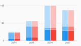
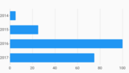
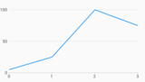
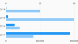

## Gallery

[//]: (Do_NOT_modify_gallery__generate_from_code)
[//]: (START_EXAMPLES)

### Bar Charts

| | | | |
| --- | --- | --- | --- |
| Simple
 | Stacked
 | Grouped
 | Grouped Stacked
 |
| Grouped Target Line
 | Stacked Horizontal
 | Stacked Target Line
 | Horizontal
 |
| Horizontal Bar Label
 | Spark Bar
 | Pattern Forward Hatch
 | Horizontal Pattern Forward Hatch
 |

### Time Series Charts

| | | | |
| --- | --- | --- | --- |
| Simple
 | Range Annotation
 | | |

### Line Charts

| | | | |
| --- | --- | --- | --- |
| Simple
 | Dash Pattern
 | Range Annotation
 | |

### Axes

| | | | |
| --- | --- | --- | --- |
| Bar Secondary Axis
 | Bar Secondary Axis Only
 | Horizontal Bar Secondary Axis
 | Short Tick Length Axis
 |
| Custom Font Size And Color
 | Measure Axis Label Alignment
 | Hidden Ticks And Labels Axis
 | Custom Axis Tick Formatters
 |
| Custom Measure Tick Count
 | Integer Only Measure Axis
 | Nonzero Bound Measure Axis
 | Nonzero Bound Measure Axis
 |
| Statically Provided Ticks
 | | | |

### Interactions

| | | | |
| --- | --- | --- | --- |
| Selection Bar Highlight
 | Selection Line Highlight
 | Selection Callback Example
 | |

### a11y

| | | | |
| --- | --- | --- | --- |
| Domain A11y Explore Bar Chart
 | | | |

### i18n

| | | | |
| --- | --- | --- | --- |
| Rtl Bar Chart
 | Rtl Line Chart
 | Rtl Series Legend
 | |

### Legends

| | | | |
| --- | --- | --- | --- |
| Simple Series Legend
 | Legend Options
 | Legend Custom Symbol
 | |

[//]: (END_EXAMPLES)

### Combo Charts

### Sizing & Margins
