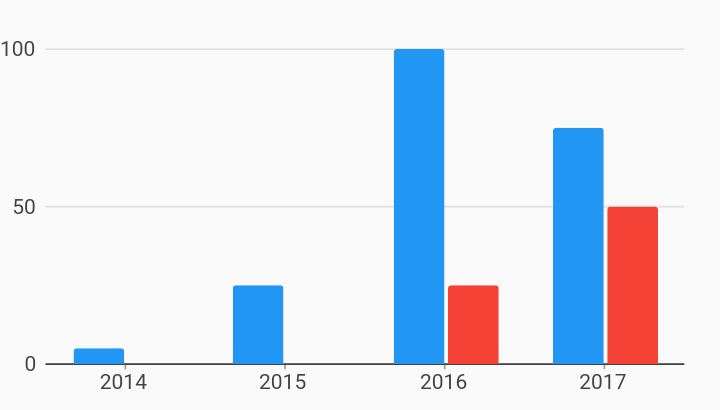

# Domain A11y Explore Bar Chart a11y Example



Example:

```
/// Example of a bar chart with domain selection A11y behavior.
///
/// The OS screen reader (TalkBack / VoiceOver) setting must be turned on, or
/// the behavior does not do anything.
///
/// Note that the screenshot does not show any visual differences but when the
/// OS screen reader is enabled, the node that is being read out loud will be
/// surrounded by a rectangle.
///
/// When [DomainA11yExploreBehavior] is added to the chart, the chart will
/// listen for the gesture that triggers "explore mode".
/// "Explore mode" creates semantic nodes for each domain value in the chart
/// with a description (customizable, defaults to domain value) and a bounding
/// box that surrounds the domain.
///
/// These semantic node descriptions are read out loud by the OS screen reader
/// when the user taps within the bounding box, or when the user cycles through
/// the screen's elements (such as swiping left and right).
import 'package:charts_flutter/flutter.dart' as charts;
import 'package:flutter/material.dart';

class DomainA11yExploreBarChart extends StatelessWidget {
  final List<charts.Series> seriesList;
  final bool animate;

  DomainA11yExploreBarChart(this.seriesList, {this.animate});

  /// Creates a [BarChart] with sample data and no transition.
  factory DomainA11yExploreBarChart.withSampleData() {
    return new DomainA11yExploreBarChart(
      _createSampleData(),
      // Disable animations for image tests.
      animate: false,
    );
  }


  /// An example of how to generate a customized vocalization for
  /// [DomainA11yExploreBehavior] from a list of [SeriesDatum]s.
  ///
  /// The list of series datums is for one domain.
  ///
  /// This example vocalizes the domain, then for each series that has that
  /// domain, it vocalizes the series display name and the measure and a
  /// description of that measure.
  String vocalizeDomainAndMeasures(List<charts.SeriesDatum> seriesDatums) {
    final buffer = new StringBuffer();

    buffer.write(seriesDatums.first.datum.year);

    for (charts.SeriesDatum seriesDatum in seriesDatums) {
      final series = seriesDatum.series;
      final datum = seriesDatum.datum;

      buffer.write(' ${series.displayName} '
          '${datum.sales / 1000} thousand dollars');
    }

    return buffer.toString();
  }

  @override
  Widget build(BuildContext context) {
    return new Semantics(
        // Describe your chart
        label: 'Yearly sales bar chart',
        // Optionally provide a hint for the user to know how to trigger
        // explore mode.
        hint: 'Press and hold to enable explore',
        child: new charts.BarChart(
          seriesList,
          animate: animate,
          // To prevent conflict with the select nearest behavior that uses the
          // tap gesture, turn off default interactions.
          defaultInteractions: false,
          behaviors: [
            new charts.DomainA11yExploreBehavior(
              // Callback for generating the message that is vocalized.
              // An example of how to use is in [vocalizeDomainAndMeasures].
              // If none is set, the default only vocalizes the domain value.
              vocalizationCallback: vocalizeDomainAndMeasures,
              // The following settings are optional, but shown here for
              // demonstration purchases.
              // [exploreModeTrigger] Default is press and hold, can be
              // changed to tap.
              exploreModeTrigger: charts.ExploreModeTrigger.pressHold,
              // [exploreModeEnabledAnnouncement] Optionally notify the OS
              // when explore mode is enabled.
              exploreModeEnabledAnnouncement: 'Explore mode enabled',
              // [exploreModeDisabledAnnouncement] Optionally notify the OS
              // when explore mode is disabled.
              exploreModeDisabledAnnouncement: 'Explore mode disabled',
              // [minimumWidth] Default and minimum is 1.0. This is the
              // minimum width of the screen reader bounding box. The bounding
              // box width is calculated based on the domain axis step size.
              // Minimum width will be used if the step size is smaller.
              minimumWidth: 1.0,
            ),
            // Optionally include domain highlighter as a behavior.
            // This behavior is included in this example to show that when an
            // a11y node has focus, the chart's internal selection model is
            // also updated.
            new charts.DomainHighlighter(charts.SelectionModelType.info),
          ],
        ));
  }

  /// Create one series with sample hard coded data.
  static List<charts.Series<OrdinalSales, String>> _createSampleData() {
    final mobileData = [
      new OrdinalSales('2014', 5),
      new OrdinalSales('2015', 25),
      new OrdinalSales('2016', 100),
      new OrdinalSales('2017', 75),
    ];

    final tabletData = [
      // Purposely missing data to show that only measures that are available
      // are vocalized.
      new OrdinalSales('2016', 25),
      new OrdinalSales('2017', 50),
    ];

    return [
      new charts.Series<OrdinalSales, String>(
        id: 'Mobile Sales',
        colorFn: (_, __) => charts.MaterialPalette.blue.shadeDefault,
        domainFn: (OrdinalSales sales, _) => sales.year,
        measureFn: (OrdinalSales sales, _) => sales.sales,
        data: mobileData,
      ),
      new charts.Series<OrdinalSales, String>(
        id: 'Tablet Sales',
        colorFn: (_, __) => charts.MaterialPalette.red.shadeDefault,
        domainFn: (OrdinalSales sales, _) => sales.year,
        measureFn: (OrdinalSales sales, _) => sales.sales,
        data: tabletData,
      )
    ];
  }
}

/// Sample ordinal data type.
class OrdinalSales {
  final String year;
  final int sales;

  OrdinalSales(this.year, this.sales);
}
```
