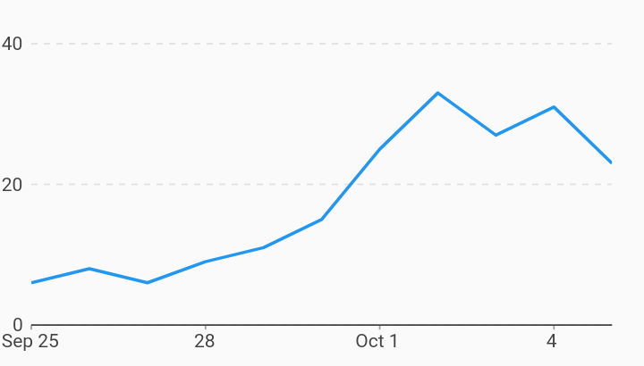

# Gridline Dash Pattern Axes Example



Example:

```
/// Example of timeseries chart with gridlines that have a dash pattern.
import 'package:charts_flutter/flutter.dart' as charts;
import 'package:flutter/material.dart';

class GridlineDashPattern extends StatelessWidget {
  final List<charts.Series> seriesList;
  final bool animate;

  GridlineDashPattern(this.seriesList, {this.animate});

  /// Creates a [TimeSeriesChart] with sample data and no transition.
  factory GridlineDashPattern.withSampleData() {
    return new GridlineDashPattern(
      _createSampleData(),
      // Disable animations for image tests.
      animate: false,
    );
  }


  @override
  Widget build(BuildContext context) {
    return new charts.TimeSeriesChart(seriesList,
        animate: animate,

        /// Customize the gridlines to use a dash pattern.
        primaryMeasureAxis: new charts.NumericAxisSpec(
            renderSpec: charts.GridlineRendererSpec(
                lineStyle: charts.LineStyleSpec(
          dashPattern: [4, 4],
        ))));
  }

  /// Create one series with sample hard coded data.
  static List<charts.Series<MyRow, DateTime>> _createSampleData() {
    final data = [
      new MyRow(new DateTime(2017, 9, 25), 6),
      new MyRow(new DateTime(2017, 9, 26), 8),
      new MyRow(new DateTime(2017, 9, 27), 6),
      new MyRow(new DateTime(2017, 9, 28), 9),
      new MyRow(new DateTime(2017, 9, 29), 11),
      new MyRow(new DateTime(2017, 9, 30), 15),
      new MyRow(new DateTime(2017, 10, 01), 25),
      new MyRow(new DateTime(2017, 10, 02), 33),
      new MyRow(new DateTime(2017, 10, 03), 27),
      new MyRow(new DateTime(2017, 10, 04), 31),
      new MyRow(new DateTime(2017, 10, 05), 23),
    ];

    return [
      new charts.Series<MyRow, DateTime>(
        id: 'Cost',
        domainFn: (MyRow row, _) => row.timeStamp,
        measureFn: (MyRow row, _) => row.cost,
        data: data,
      )
    ];
  }
}

/// Sample time series data type.
class MyRow {
  final DateTime timeStamp;
  final int cost;
  MyRow(this.timeStamp, this.cost);
}
```
