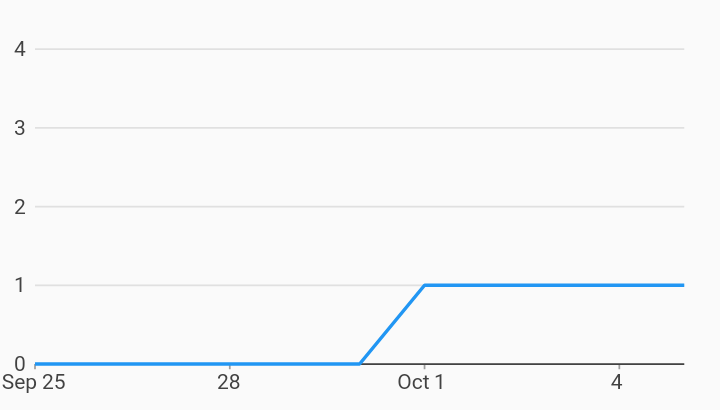

# Integer Only Measure Axis Axes Example



Example:

```
/// Example of timeseries chart forcing the measure axis to have whole number
/// ticks. This is useful if the measure units don't make sense to present as
/// fractional.
///
/// This is done by customizing the measure axis and setting
/// [dataIsInWholeNumbers] on the tick provider.
import 'package:charts_flutter/flutter.dart' as charts;
import 'package:flutter/material.dart';

class IntegerOnlyMeasureAxis extends StatelessWidget {
  final List<charts.Series> seriesList;
  final bool animate;

  IntegerOnlyMeasureAxis(this.seriesList, {this.animate});

  /// Creates a [TimeSeriesChart] with sample data and no transition.
  factory IntegerOnlyMeasureAxis.withSampleData() {
    return new IntegerOnlyMeasureAxis(
      _createSampleData(),
      // Disable animations for image tests.
      animate: false,
    );
  }


  @override
  Widget build(BuildContext context) {
    return new charts.TimeSeriesChart(
      seriesList,
      animate: animate,
      // Provides a custom axis ensuring that the ticks are in whole numbers.
      primaryMeasureAxis: new charts.NumericAxisSpec(
          tickProviderSpec: new charts.BasicNumericTickProviderSpec(
              // Make sure we don't have values less than 1 as ticks
              // (ie: counts).
              dataIsInWholeNumbers: true,
              // Fixed tick count to highlight the integer only behavior
              // generating ticks [0, 1, 2, 3, 4].
              desiredTickCount: 5)),
    );
  }

  /// Create one series with sample hard coded data.
  static List<charts.Series<MyRow, DateTime>> _createSampleData() {
    final data = [
      new MyRow(new DateTime(2017, 9, 25), 0),
      new MyRow(new DateTime(2017, 9, 26), 0),
      new MyRow(new DateTime(2017, 9, 27), 0),
      new MyRow(new DateTime(2017, 9, 28), 0),
      new MyRow(new DateTime(2017, 9, 29), 0),
      new MyRow(new DateTime(2017, 9, 30), 0),
      new MyRow(new DateTime(2017, 10, 01), 1),
      new MyRow(new DateTime(2017, 10, 02), 1),
      new MyRow(new DateTime(2017, 10, 03), 1),
      new MyRow(new DateTime(2017, 10, 04), 1),
      new MyRow(new DateTime(2017, 10, 05), 1),
    ];

    return [
      new charts.Series<MyRow, DateTime>(
        id: 'Headcount',
        domainFn: (MyRow row, _) => row.timeStamp,
        measureFn: (MyRow row, _) => row.headcount,
        data: data,
      )
    ];
  }
}

/// Sample time series data type.
class MyRow {
  final DateTime timeStamp;
  final int headcount;
  MyRow(this.timeStamp, this.headcount);
}
```
