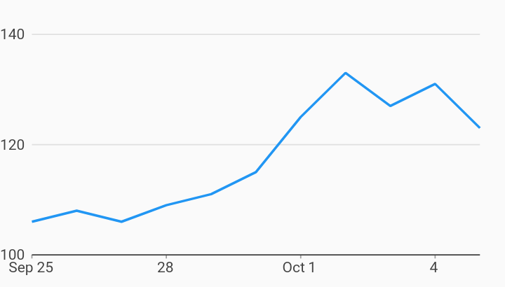

# Nonzero Bound Measure Axis Axes Example



Example:

```
/// Example of timeseries chart that has a measure axis that does NOT include
/// zero. It starts at 100 and goes to 140.
import 'package:charts_flutter/flutter.dart' as charts;
import 'package:flutter/material.dart';

class NonzeroBoundMeasureAxis extends StatelessWidget {
  final List<charts.Series> seriesList;
  final bool animate;

  NonzeroBoundMeasureAxis(this.seriesList, {this.animate});

  /// Creates a [TimeSeriesChart] with sample data and no transition.
  factory NonzeroBoundMeasureAxis.withSampleData() {
    return new NonzeroBoundMeasureAxis(
      _createSampleData(),
      // Disable animations for image tests.
      animate: false,
    );
  }


  @override
  Widget build(BuildContext context) {
    return new charts.TimeSeriesChart(seriesList,
        animate: animate,
        // Provide a tickProviderSpec which does NOT require that zero is
        // included.
        primaryMeasureAxis: new charts.NumericAxisSpec(
            tickProviderSpec:
                new charts.BasicNumericTickProviderSpec(zeroBound: false)));
  }

  /// Create one series with sample hard coded data.
  static List<charts.Series<MyRow, DateTime>> _createSampleData() {
    final data = [
      new MyRow(new DateTime(2017, 9, 25), 106),
      new MyRow(new DateTime(2017, 9, 26), 108),
      new MyRow(new DateTime(2017, 9, 27), 106),
      new MyRow(new DateTime(2017, 9, 28), 109),
      new MyRow(new DateTime(2017, 9, 29), 111),
      new MyRow(new DateTime(2017, 9, 30), 115),
      new MyRow(new DateTime(2017, 10, 01), 125),
      new MyRow(new DateTime(2017, 10, 02), 133),
      new MyRow(new DateTime(2017, 10, 03), 127),
      new MyRow(new DateTime(2017, 10, 04), 131),
      new MyRow(new DateTime(2017, 10, 05), 123),
    ];

    return [
      new charts.Series<MyRow, DateTime>(
        id: 'Headcount',
        domainFn: (MyRow row, _) => row.timeStamp,
        measureFn: (MyRow row, _) => row.headcount,
        data: data,
      )
    ];
  }
}

/// Sample time series data type.
class MyRow {
  final DateTime timeStamp;
  final int headcount;
  MyRow(this.timeStamp, this.headcount);
}
```
