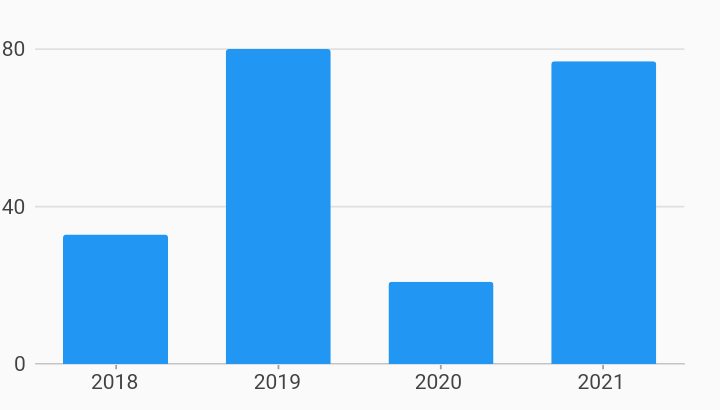

# Ordinal Initial Viewport Axes Example



Example:

```
/// Example of setting an initial viewport for ordinal axis.
///
/// This allows for specifying the specific range of data to show that differs
/// from what was provided in the series list.
///
/// In this example, the series list has ordinal data from year 2014 to 2030,
/// but we want to show starting at 2018 and we only want to show 4 values.
/// We can do this by specifying an [OrdinalViewport] in [OrdinalAxisSpec].

import 'package:charts_flutter/flutter.dart' as charts;
import 'package:flutter/material.dart';

class OrdinalInitialViewport extends StatelessWidget {
  final List<charts.Series> seriesList;
  final bool animate;

  OrdinalInitialViewport(this.seriesList, {this.animate});

  /// Creates a [BarChart] with sample data and no transition.
  factory OrdinalInitialViewport.withSampleData() {
    return new OrdinalInitialViewport(
      _createSampleData(),
      // Disable animations for image tests.
      animate: false,
    );
  }


  @override
  Widget build(BuildContext context) {
    return new charts.BarChart(
      seriesList,
      animate: animate,
      // Set the initial viewport by providing a new AxisSpec with the
      // desired viewport: a starting domain and the data size.
      domainAxis: new charts.OrdinalAxisSpec(
          viewport: new charts.OrdinalViewport('2018', 4)),
      // Optionally add a pan or pan and zoom behavior.
      // If pan/zoom is not added, the viewport specified remains the viewport.
      behaviors: [new charts.PanAndZoomBehavior()],
    );
  }

  /// Create one series with sample hard coded data.
  static List<charts.Series<OrdinalSales, String>> _createSampleData() {
    final data = [
      new OrdinalSales('2014', 5),
      new OrdinalSales('2015', 25),
      new OrdinalSales('2016', 100),
      new OrdinalSales('2017', 75),
      new OrdinalSales('2018', 33),
      new OrdinalSales('2019', 80),
      new OrdinalSales('2020', 21),
      new OrdinalSales('2021', 77),
      new OrdinalSales('2022', 8),
      new OrdinalSales('2023', 12),
      new OrdinalSales('2024', 42),
      new OrdinalSales('2025', 70),
      new OrdinalSales('2026', 77),
      new OrdinalSales('2027', 55),
      new OrdinalSales('2028', 19),
      new OrdinalSales('2029', 66),
      new OrdinalSales('2030', 27),
    ];

    return [
      new charts.Series<OrdinalSales, String>(
        id: 'Sales',
        colorFn: (_, __) => charts.MaterialPalette.blue.shadeDefault,
        domainFn: (OrdinalSales sales, _) => sales.year,
        measureFn: (OrdinalSales sales, _) => sales.sales,
        data: data,
      )
    ];
  }
}

/// Sample ordinal data type.
class OrdinalSales {
  final String year;
  final int sales;

  OrdinalSales(this.year, this.sales);
}
```
