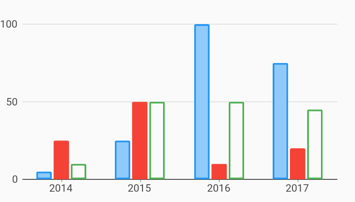

# Grouped Fill Color Bar Chart Example



Example:

```
/// Bar chart example
import 'package:flutter/material.dart';
import 'package:charts_flutter/flutter.dart' as charts;

/// Example of a grouped bar chart with three series, each rendered with
/// different fill colors.
class GroupedFillColorBarChart extends StatelessWidget {
  final List<charts.Series> seriesList;
  final bool animate;

  GroupedFillColorBarChart(this.seriesList, {this.animate});

  factory GroupedFillColorBarChart.withSampleData() {
    return new GroupedFillColorBarChart(
      _createSampleData(),
      // Disable animations for image tests.
      animate: false,
    );
  }


  @override
  Widget build(BuildContext context) {
    return new charts.BarChart(
      seriesList,
      animate: animate,
      // Configure a stroke width to enable borders on the bars.
      defaultRenderer: new charts.BarRendererConfig(
          groupingType: charts.BarGroupingType.grouped, strokeWidthPx: 2.0),
    );
  }

  /// Create series list with multiple series
  static List<charts.Series<OrdinalSales, String>> _createSampleData() {
    final desktopSalesData = [
      new OrdinalSales('2014', 5),
      new OrdinalSales('2015', 25),
      new OrdinalSales('2016', 100),
      new OrdinalSales('2017', 75),
    ];

    final tableSalesData = [
      new OrdinalSales('2014', 25),
      new OrdinalSales('2015', 50),
      new OrdinalSales('2016', 10),
      new OrdinalSales('2017', 20),
    ];

    final mobileSalesData = [
      new OrdinalSales('2014', 10),
      new OrdinalSales('2015', 50),
      new OrdinalSales('2016', 50),
      new OrdinalSales('2017', 45),
    ];

    return [
      // Blue bars with a lighter center color.
      new charts.Series<OrdinalSales, String>(
        id: 'Desktop',
        domainFn: (OrdinalSales sales, _) => sales.year,
        measureFn: (OrdinalSales sales, _) => sales.sales,
        data: desktopSalesData,
        colorFn: (_, __) => charts.MaterialPalette.blue.shadeDefault,
        fillColorFn: (_, __) =>
            charts.MaterialPalette.blue.shadeDefault.lighter,
      ),
      // Solid red bars. Fill color will default to the series color if no
      // fillColorFn is configured.
      new charts.Series<OrdinalSales, String>(
        id: 'Tablet',
        measureFn: (OrdinalSales sales, _) => sales.sales,
        data: tableSalesData,
        colorFn: (_, __) => charts.MaterialPalette.red.shadeDefault,
        domainFn: (OrdinalSales sales, _) => sales.year,
      ),
      // Hollow green bars.
      new charts.Series<OrdinalSales, String>(
        id: 'Mobile',
        domainFn: (OrdinalSales sales, _) => sales.year,
        measureFn: (OrdinalSales sales, _) => sales.sales,
        data: mobileSalesData,
        colorFn: (_, __) => charts.MaterialPalette.green.shadeDefault,
        fillColorFn: (_, __) => charts.MaterialPalette.transparent,
      ),
    ];
  }
}

/// Sample ordinal data type.
class OrdinalSales {
  final String year;
  final int sales;

  OrdinalSales(this.year, this.sales);
}
```
