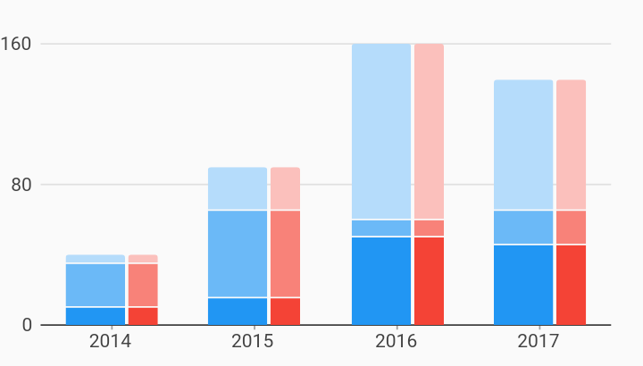

# Grouped Stacked Weight Pattern Bar Chart Example



Example:

```
/// Example of a bar chart with grouped, stacked series oriented vertically with
/// a custom weight pattern.
///
/// This is a pattern of weights used to calculate the width of bars within a
/// bar group. If not specified, each bar in the group will have an equal width.
import 'package:flutter/material.dart';
import 'package:charts_flutter/flutter.dart' as charts;

class GroupedStackedWeightPatternBarChart extends StatelessWidget {
  final List<charts.Series> seriesList;
  final bool animate;

  GroupedStackedWeightPatternBarChart(this.seriesList, {this.animate});

  factory GroupedStackedWeightPatternBarChart.withSampleData() {
    return new GroupedStackedWeightPatternBarChart(
      createSampleData(),
      // Disable animations for image tests.
      animate: false,
    );
  }


  @override
  Widget build(BuildContext context) {
    return new charts.BarChart(
      seriesList,
      animate: animate,
      // Configure the bar renderer in grouped stacked rendering mode with a
      // custom weight pattern.
      //
      // The first stack of bars in each group is configured to be twice as wide
      // as the second stack of bars in each group.
      defaultRenderer: new charts.BarRendererConfig(
        groupingType: charts.BarGroupingType.groupedStacked,
        weightPattern: [2, 1],
      ),
    );
  }

  /// Create series list with multiple series
  static List<charts.Series<OrdinalSales, String>> createSampleData() {
    final desktopSalesDataA = [
      new OrdinalSales('2014', 5),
      new OrdinalSales('2015', 25),
      new OrdinalSales('2016', 100),
      new OrdinalSales('2017', 75),
    ];

    final tableSalesDataA = [
      new OrdinalSales('2014', 25),
      new OrdinalSales('2015', 50),
      new OrdinalSales('2016', 10),
      new OrdinalSales('2017', 20),
    ];

    final mobileSalesDataA = [
      new OrdinalSales('2014', 10),
      new OrdinalSales('2015', 15),
      new OrdinalSales('2016', 50),
      new OrdinalSales('2017', 45),
    ];

    final desktopSalesDataB = [
      new OrdinalSales('2014', 5),
      new OrdinalSales('2015', 25),
      new OrdinalSales('2016', 100),
      new OrdinalSales('2017', 75),
    ];

    final tableSalesDataB = [
      new OrdinalSales('2014', 25),
      new OrdinalSales('2015', 50),
      new OrdinalSales('2016', 10),
      new OrdinalSales('2017', 20),
    ];

    final mobileSalesDataB = [
      new OrdinalSales('2014', 10),
      new OrdinalSales('2015', 15),
      new OrdinalSales('2016', 50),
      new OrdinalSales('2017', 45),
    ];

    return [
      new charts.Series<OrdinalSales, String>(
        id: 'Desktop A',
        seriesCategory: 'A',
        domainFn: (OrdinalSales sales, _) => sales.year,
        measureFn: (OrdinalSales sales, _) => sales.sales,
        data: desktopSalesDataA,
      ),
      new charts.Series<OrdinalSales, String>(
        id: 'Tablet A',
        seriesCategory: 'A',
        domainFn: (OrdinalSales sales, _) => sales.year,
        measureFn: (OrdinalSales sales, _) => sales.sales,
        data: tableSalesDataA,
      ),
      new charts.Series<OrdinalSales, String>(
        id: 'Mobile A',
        seriesCategory: 'A',
        domainFn: (OrdinalSales sales, _) => sales.year,
        measureFn: (OrdinalSales sales, _) => sales.sales,
        data: mobileSalesDataA,
      ),
      new charts.Series<OrdinalSales, String>(
        id: 'Desktop B',
        seriesCategory: 'B',
        domainFn: (OrdinalSales sales, _) => sales.year,
        measureFn: (OrdinalSales sales, _) => sales.sales,
        data: desktopSalesDataB,
      ),
      new charts.Series<OrdinalSales, String>(
        id: 'Tablet B',
        seriesCategory: 'B',
        domainFn: (OrdinalSales sales, _) => sales.year,
        measureFn: (OrdinalSales sales, _) => sales.sales,
        data: tableSalesDataB,
      ),
      new charts.Series<OrdinalSales, String>(
        id: 'Mobile B',
        seriesCategory: 'B',
        domainFn: (OrdinalSales sales, _) => sales.year,
        measureFn: (OrdinalSales sales, _) => sales.sales,
        data: mobileSalesDataB,
      ),
    ];
  }
}

/// Sample ordinal data type.
class OrdinalSales {
  final String year;
  final int sales;

  OrdinalSales(this.year, this.sales);
}
```
