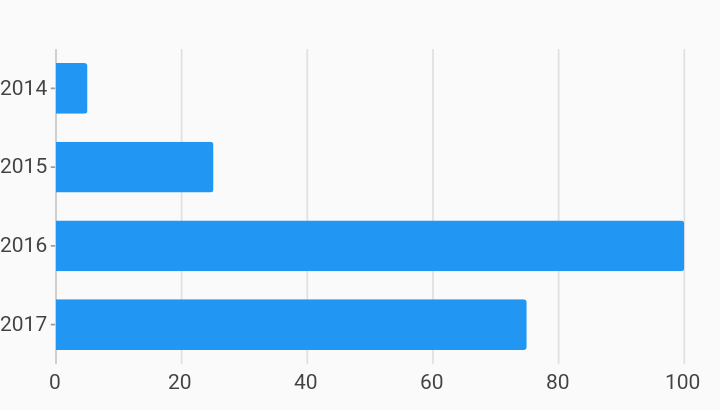

# Horizontal Bar Chart Example



Example:

```
/// Horizontal bar chart example
import 'package:charts_flutter/flutter.dart' as charts;
import 'package:flutter/material.dart';

class HorizontalBarChart extends StatelessWidget {
  final List<charts.Series> seriesList;
  final bool animate;

  HorizontalBarChart(this.seriesList, {this.animate});

  /// Creates a [BarChart] with sample data and no transition.
  factory HorizontalBarChart.withSampleData() {
    return new HorizontalBarChart(
      _createSampleData(),
      // Disable animations for image tests.
      animate: false,
    );
  }


  @override
  Widget build(BuildContext context) {
    // For horizontal bar charts, set the [vertical] flag to false.
    return new charts.BarChart(
      seriesList,
      animate: animate,
      vertical: false,
    );
  }

  /// Create one series with sample hard coded data.
  static List<charts.Series<OrdinalSales, String>> _createSampleData() {
    final data = [
      new OrdinalSales('2014', 5),
      new OrdinalSales('2015', 25),
      new OrdinalSales('2016', 100),
      new OrdinalSales('2017', 75),
    ];

    return [
      new charts.Series<OrdinalSales, String>(
        id: 'Sales',
        domainFn: (OrdinalSales sales, _) => sales.year,
        measureFn: (OrdinalSales sales, _) => sales.sales,
        data: data,
      )
    ];
  }
}

/// Sample ordinal data type.
class OrdinalSales {
  final String year;
  final int sales;

  OrdinalSales(this.year, this.sales);
}
```
