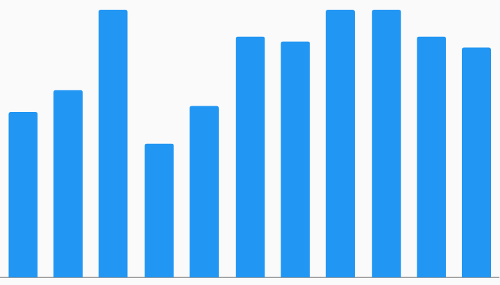

# Spark Bar Bar Chart Example



Example:

```
/// Spark Bar Example
import 'package:flutter/material.dart';
import 'package:charts_flutter/flutter.dart' as charts;

/// Example of a Spark Bar by hiding both axis, reducing the chart margins.
class SparkBar extends StatelessWidget {
  final List<charts.Series> seriesList;
  final bool animate;

  SparkBar(this.seriesList, {this.animate});

  factory SparkBar.withSampleData() {
    return new SparkBar(
      _createSampleData(),
      // Disable animations for image tests.
      animate: false,
    );
  }


  @override
  Widget build(BuildContext context) {
    return new charts.BarChart(
      seriesList,
      animate: animate,

      /// Assign a custom style for the measure axis.
      ///
      /// The NoneRenderSpec only draws an axis line (and even that can be hidden
      /// with showAxisLine=false).
      primaryMeasureAxis:
          new charts.NumericAxisSpec(renderSpec: new charts.NoneRenderSpec()),

      /// This is an OrdinalAxisSpec to match up with BarChart's default
      /// ordinal domain axis (use NumericAxisSpec or DateTimeAxisSpec for
      /// other charts).
      domainAxis: new charts.OrdinalAxisSpec(
          // Make sure that we draw the domain axis line.
          showAxisLine: true,
          // But don't draw anything else.
          renderSpec: new charts.NoneRenderSpec()),

      // With a spark chart we likely don't want large chart margins.
      // 1px is the smallest we can make each margin.
      layoutConfig: new charts.LayoutConfig(
          leftMarginSpec: new charts.MarginSpec.fixedPixel(0),
          topMarginSpec: new charts.MarginSpec.fixedPixel(0),
          rightMarginSpec: new charts.MarginSpec.fixedPixel(0),
          bottomMarginSpec: new charts.MarginSpec.fixedPixel(0)),
    );
  }

  /// Create series list with single series
  static List<charts.Series<OrdinalSales, String>> _createSampleData() {
    final globalSalesData = [
      new OrdinalSales('2007', 3100),
      new OrdinalSales('2008', 3500),
      new OrdinalSales('2009', 5000),
      new OrdinalSales('2010', 2500),
      new OrdinalSales('2011', 3200),
      new OrdinalSales('2012', 4500),
      new OrdinalSales('2013', 4400),
      new OrdinalSales('2014', 5000),
      new OrdinalSales('2015', 5000),
      new OrdinalSales('2016', 4500),
      new OrdinalSales('2017', 4300),
    ];

    return [
      new charts.Series<OrdinalSales, String>(
        id: 'Global Revenue',
        domainFn: (OrdinalSales sales, _) => sales.year,
        measureFn: (OrdinalSales sales, _) => sales.sales,
        data: globalSalesData,
      ),
    ];
  }
}

/// Sample ordinal data type.
class OrdinalSales {
  final String year;
  final int sales;

  OrdinalSales(this.year, this.sales);
}
```
