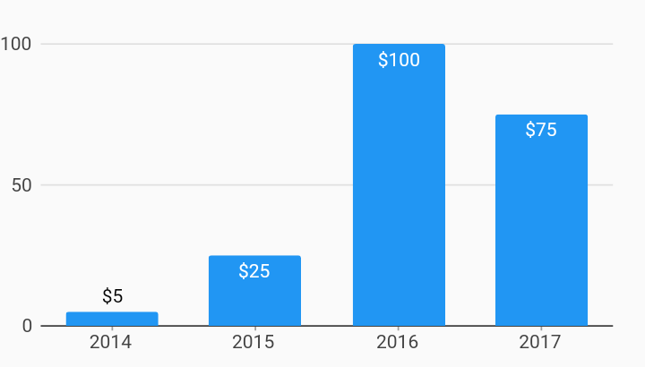

# Vertical Bar Label Bar Chart Example



Example:

```
/// Vertical bar chart with bar label renderer example.
import 'package:charts_flutter/flutter.dart' as charts;
import 'package:flutter/material.dart';

class VerticalBarLabelChart extends StatelessWidget {
  final List<charts.Series> seriesList;
  final bool animate;

  VerticalBarLabelChart(this.seriesList, {this.animate});

  /// Creates a [BarChart] with sample data and no transition.
  factory VerticalBarLabelChart.withSampleData() {
    return new VerticalBarLabelChart(
      _createSampleData(),
      // Disable animations for image tests.
      animate: false,
    );
  }


  // [BarLabelDecorator] will automatically position the label
  // inside the bar if the label will fit. If the label will not fit,
  // it will draw outside of the bar.
  // Labels can always display inside or outside using [LabelPosition].
  //
  // Text style for inside / outside can be controlled independently by setting
  // [insideLabelStyleSpec] and [outsideLabelStyleSpec].
  @override
  Widget build(BuildContext context) {
    return new charts.BarChart(
      seriesList,
      animate: animate,
      // Set a bar label decorator.
      // Example configuring different styles for inside/outside:
      //       barRendererDecorator: new charts.BarLabelDecorator(
      //          insideLabelStyleSpec: new charts.TextStyleSpec(...),
      //          outsideLabelStyleSpec: new charts.TextStyleSpec(...)),
      barRendererDecorator: new charts.BarLabelDecorator<String>(),
      domainAxis: new charts.OrdinalAxisSpec(),
    );
  }

  /// Create one series with sample hard coded data.
  static List<charts.Series<OrdinalSales, String>> _createSampleData() {
    final data = [
      new OrdinalSales('2014', 5),
      new OrdinalSales('2015', 25),
      new OrdinalSales('2016', 100),
      new OrdinalSales('2017', 75),
    ];

    return [
      new charts.Series<OrdinalSales, String>(
          id: 'Sales',
          domainFn: (OrdinalSales sales, _) => sales.year,
          measureFn: (OrdinalSales sales, _) => sales.sales,
          data: data,
          // Set a label accessor to control the text of the bar label.
          labelAccessorFn: (OrdinalSales sales, _) =>
              '\$${sales.sales.toString()}')
    ];
  }
}

/// Sample ordinal data type.
class OrdinalSales {
  final String year;
  final int sales;

  OrdinalSales(this.year, this.sales);
}
```
