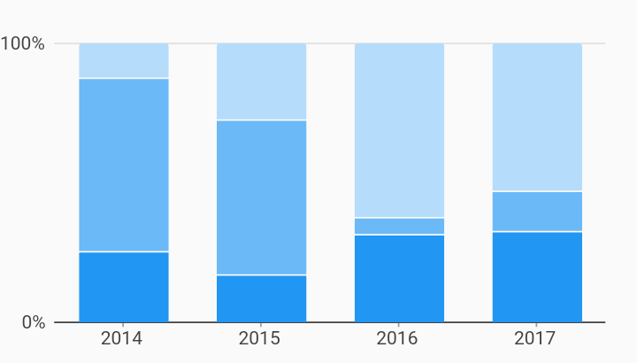

# Percent Of Domain Interactions Example



Example:

```
/// Example of a percentage bar chart with stacked series oriented vertically.
///
/// Each bar stack shows the percentage of each measure out of the total measure
/// value of the stack.
import 'package:flutter/material.dart';
import 'package:charts_flutter/flutter.dart' as charts;

class PercentOfDomainBarChart extends StatelessWidget {
  final List<charts.Series> seriesList;
  final bool animate;

  PercentOfDomainBarChart(this.seriesList, {this.animate});

  /// Creates a stacked [BarChart] with sample data and no transition.
  factory PercentOfDomainBarChart.withSampleData() {
    return new PercentOfDomainBarChart(
      _createSampleData(),
      // Disable animations for image tests.
      animate: false,
    );
  }


  @override
  Widget build(BuildContext context) {
    return new charts.BarChart(
      seriesList,
      animate: animate,
      barGroupingType: charts.BarGroupingType.stacked,
      // Configures a [PercentInjector] behavior that will calculate measure
      // values as the percentage of the total of all data that shares a
      // domain value.
      behaviors: [
        new charts.PercentInjector<String>(
            totalType: charts.PercentInjectorTotalType.domain)
      ],
      // Configure the axis spec to show percentage values.
      primaryMeasureAxis: new charts.PercentAxisSpec(),
    );
  }

  /// Create series list with multiple series
  static List<charts.Series<OrdinalSales, String>> _createSampleData() {
    final desktopSalesData = [
      new OrdinalSales('2014', 5),
      new OrdinalSales('2015', 25),
      new OrdinalSales('2016', 100),
      new OrdinalSales('2017', 75),
    ];

    final tableSalesData = [
      new OrdinalSales('2014', 25),
      new OrdinalSales('2015', 50),
      new OrdinalSales('2016', 10),
      new OrdinalSales('2017', 20),
    ];

    final mobileSalesData = [
      new OrdinalSales('2014', 10),
      new OrdinalSales('2015', 15),
      new OrdinalSales('2016', 50),
      new OrdinalSales('2017', 45),
    ];

    return [
      new charts.Series<OrdinalSales, String>(
        id: 'Desktop',
        domainFn: (OrdinalSales sales, _) => sales.year,
        measureFn: (OrdinalSales sales, _) => sales.sales,
        data: desktopSalesData,
      ),
      new charts.Series<OrdinalSales, String>(
        id: 'Tablet',
        domainFn: (OrdinalSales sales, _) => sales.year,
        measureFn: (OrdinalSales sales, _) => sales.sales,
        data: tableSalesData,
      ),
      new charts.Series<OrdinalSales, String>(
        id: 'Mobile',
        domainFn: (OrdinalSales sales, _) => sales.year,
        measureFn: (OrdinalSales sales, _) => sales.sales,
        data: mobileSalesData,
      ),
    ];
  }
}

/// Sample ordinal data type.
class OrdinalSales {
  final String year;
  final int sales;

  OrdinalSales(this.year, this.sales);
}
```
