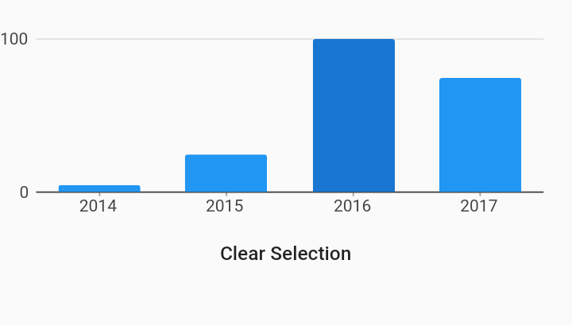

# Selection User Managed Behaviors Example



Example:

```
/// Example of using user managed state to programmatically set selection.
///
/// In this example, clicking the "clear selection" button sets the selection
/// to an empty selection. This example also shows that initial selection
/// behavior can still be used with user managed state.
///
/// Note that the picture in this example is not interactive, please run the
/// gallery app to try out using the button to clear selection.
///
import 'package:charts_flutter/flutter.dart' as charts;
import 'package:flutter/material.dart';

class SelectionUserManaged extends StatefulWidget {
  final List<charts.Series> seriesList;
  final bool animate;

  SelectionUserManaged(this.seriesList, {this.animate});

  /// Creates a [BarChart] with sample data and no transition.
  factory SelectionUserManaged.withSampleData() {
    return new SelectionUserManaged(
      _createSampleData(),
      // Disable animations for image tests.
      animate: false,
    );
  }


  /// Create one series with sample hard coded data.
  static List<charts.Series<OrdinalSales, String>> _createSampleData() {
    final data = [
      new OrdinalSales('2014', 5),
      new OrdinalSales('2015', 25),
      new OrdinalSales('2016', 100),
      new OrdinalSales('2017', 75),
    ];

    return [
      new charts.Series<OrdinalSales, String>(
        id: 'Sales',
        colorFn: (_, __) => charts.MaterialPalette.blue.shadeDefault,
        domainFn: (OrdinalSales sales, _) => sales.year,
        measureFn: (OrdinalSales sales, _) => sales.sales,
        data: data,
      )
    ];
  }

  @override
  SelectionUserManagedState createState() {
    return new SelectionUserManagedState();
  }
}

class SelectionUserManagedState extends State<SelectionUserManaged> {
  final _myState = new charts.UserManagedState<String>();

  @override
  Widget build(BuildContext context) {
    final chart = new charts.BarChart(
      widget.seriesList,
      animate: false, //widget.animate,
      selectionModels: [
        new charts.SelectionModelConfig(
            type: charts.SelectionModelType.info,
            updatedListener: _infoSelectionModelUpdated)
      ],
      // Pass in the state you manage to the chart. This will be used to
      // override the internal chart state.
      userManagedState: _myState,
      // The initial selection can still be optionally added by adding the
      // initial selection behavior.
      behaviors: [
        new charts.InitialSelection(selectedDataConfig: [
          new charts.SeriesDatumConfig<String>('Sales', '2016')
        ])
      ],
    );

    final clearSelection = new MaterialButton(
        onPressed: _handleClearSelection, child: new Text('Clear Selection'));

    return new Column(
        children: [new SizedBox(child: chart, height: 150.0), clearSelection]);
  }

  void _infoSelectionModelUpdated(charts.SelectionModel<String> model) {
    // If you want to allow the chart to continue to respond to select events
    // that update the selection, add an updatedListener that saves off the
    // selection model each time the selection model is updated, regardless of
    // if there are changes.
    //
    // This also allows you to listen to the selection model update events and
    // alter the selection.
    _myState.selectionModels[charts.SelectionModelType.info] =
        new charts.UserManagedSelectionModel(model: model);
  }

  void _handleClearSelection() {
    // Call set state to request a rebuild, to pass in the modified selection.
    // In this case, passing in an empty [UserManagedSelectionModel] creates a
    // no selection model to clear all selection when rebuilt.
    setState(() {
      _myState.selectionModels[charts.SelectionModelType.info] =
          new charts.UserManagedSelectionModel();
    });
  }
}

/// Sample ordinal data type.
class OrdinalSales {
  final String year;
  final int sales;

  OrdinalSales(this.year, this.sales);
}
```
