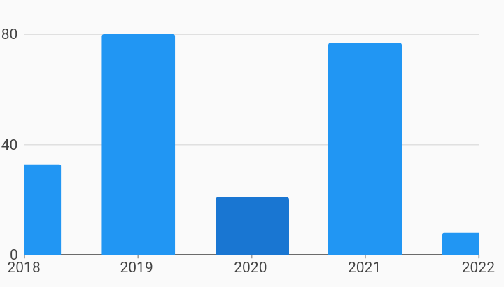

# Sliding Viewport On Selection Behaviors Example



Example:

```
/// Example of the chart behavior that centers the viewport on domain selection.

import 'package:charts_flutter/flutter.dart' as charts;
import 'package:flutter/material.dart';

class SlidingViewportOnSelection extends StatelessWidget {
  final List<charts.Series> seriesList;
  final bool animate;

  SlidingViewportOnSelection(this.seriesList, {this.animate});

  /// Creates a [BarChart] with sample data and no transition.
  factory SlidingViewportOnSelection.withSampleData() {
    return new SlidingViewportOnSelection(
      _createSampleData(),
      // Disable animations for image tests.
      animate: false,
    );
  }


  @override
  Widget build(BuildContext context) {
    return new charts.BarChart(
      seriesList,
      animate: animate,
      behaviors: [
        // Add the sliding viewport behavior to have the viewport center on the
        // domain that is currently selected.
        new charts.SlidingViewport(),
        // A pan and zoom behavior helps demonstrate the sliding viewport
        // behavior by allowing the data visible in the viewport to be adjusted
        // dynamically.
        new charts.PanAndZoomBehavior(),
      ],
      // Set an initial viewport to demonstrate the sliding viewport behavior on
      // initial chart load.
      domainAxis: new charts.OrdinalAxisSpec(
          viewport: new charts.OrdinalViewport('2018', 4)),
    );
  }

  /// Create one series with sample hard coded data.
  static List<charts.Series<OrdinalSales, String>> _createSampleData() {
    final data = [
      new OrdinalSales('2014', 5),
      new OrdinalSales('2015', 25),
      new OrdinalSales('2016', 100),
      new OrdinalSales('2017', 75),
      new OrdinalSales('2018', 33),
      new OrdinalSales('2019', 80),
      new OrdinalSales('2020', 21),
      new OrdinalSales('2021', 77),
      new OrdinalSales('2022', 8),
      new OrdinalSales('2023', 12),
      new OrdinalSales('2024', 42),
      new OrdinalSales('2025', 70),
      new OrdinalSales('2026', 77),
      new OrdinalSales('2027', 55),
      new OrdinalSales('2028', 19),
      new OrdinalSales('2029', 66),
      new OrdinalSales('2030', 27),
    ];

    return [
      new charts.Series<OrdinalSales, String>(
        id: 'Sales',
        colorFn: (_, __) => charts.MaterialPalette.blue.shadeDefault,
        domainFn: (OrdinalSales sales, _) => sales.year,
        measureFn: (OrdinalSales sales, _) => sales.sales,
        data: data,
      )
    ];
  }
}

/// Sample ordinal data type.
class OrdinalSales {
  final String year;
  final int sales;

  OrdinalSales(this.year, this.sales);
}
```
