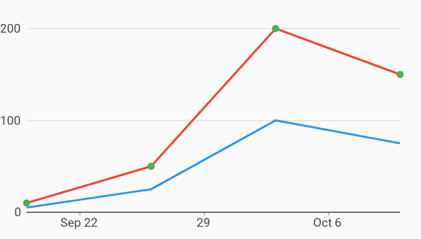

# Date Time Line Point Combo Chart Example



Example:

```
/// Example of a combo time series chart with two series rendered as lines, and
/// a third rendered as points along the top line with a different color.
///
/// This example demonstrates a method for drawing points along a line using a
/// different color from the main series color. The line renderer supports
/// drawing points with the "includePoints" option, but those points will share
/// the same color as the line.
import 'package:charts_flutter/flutter.dart' as charts;
import 'package:flutter/material.dart';

class DateTimeComboLinePointChart extends StatelessWidget {
  final List<charts.Series> seriesList;
  final bool animate;

  DateTimeComboLinePointChart(this.seriesList, {this.animate});

  /// Creates a [TimeSeriesChart] with sample data and no transition.
  factory DateTimeComboLinePointChart.withSampleData() {
    return new DateTimeComboLinePointChart(
      _createSampleData(),
      // Disable animations for image tests.
      animate: false,
    );
  }


  @override
  Widget build(BuildContext context) {
    return new charts.TimeSeriesChart(
      seriesList,
      animate: animate,
      // Configure the default renderer as a line renderer. This will be used
      // for any series that does not define a rendererIdKey.
      //
      // This is the default configuration, but is shown here for  illustration.
      defaultRenderer: new charts.LineRendererConfig(),
      // Custom renderer configuration for the point series.
      customSeriesRenderers: [
        new charts.PointRendererConfig(
            // ID used to link series to this renderer.
            customRendererId: 'customPoint')
      ],
      // Optionally pass in a [DateTimeFactory] used by the chart. The factory
      // should create the same type of [DateTime] as the data provided. If none
      // specified, the default creates local date time.
      dateTimeFactory: const charts.LocalDateTimeFactory(),
    );
  }

  /// Create one series with sample hard coded data.
  static List<charts.Series<TimeSeriesSales, DateTime>> _createSampleData() {
    final desktopSalesData = [
      new TimeSeriesSales(new DateTime(2017, 9, 19), 5),
      new TimeSeriesSales(new DateTime(2017, 9, 26), 25),
      new TimeSeriesSales(new DateTime(2017, 10, 3), 100),
      new TimeSeriesSales(new DateTime(2017, 10, 10), 75),
    ];

    final tableSalesData = [
      new TimeSeriesSales(new DateTime(2017, 9, 19), 10),
      new TimeSeriesSales(new DateTime(2017, 9, 26), 50),
      new TimeSeriesSales(new DateTime(2017, 10, 3), 200),
      new TimeSeriesSales(new DateTime(2017, 10, 10), 150),
    ];

    final mobileSalesData = [
      new TimeSeriesSales(new DateTime(2017, 9, 19), 10),
      new TimeSeriesSales(new DateTime(2017, 9, 26), 50),
      new TimeSeriesSales(new DateTime(2017, 10, 3), 200),
      new TimeSeriesSales(new DateTime(2017, 10, 10), 150),
    ];

    return [
      new charts.Series<TimeSeriesSales, DateTime>(
        id: 'Desktop',
        colorFn: (_, __) => charts.MaterialPalette.blue.shadeDefault,
        domainFn: (TimeSeriesSales sales, _) => sales.time,
        measureFn: (TimeSeriesSales sales, _) => sales.sales,
        data: desktopSalesData,
      ),
      new charts.Series<TimeSeriesSales, DateTime>(
        id: 'Tablet',
        colorFn: (_, __) => charts.MaterialPalette.red.shadeDefault,
        domainFn: (TimeSeriesSales sales, _) => sales.time,
        measureFn: (TimeSeriesSales sales, _) => sales.sales,
        data: tableSalesData,
      ),
      new charts.Series<TimeSeriesSales, DateTime>(
          id: 'Mobile',
          colorFn: (_, __) => charts.MaterialPalette.green.shadeDefault,
          domainFn: (TimeSeriesSales sales, _) => sales.time,
          measureFn: (TimeSeriesSales sales, _) => sales.sales,
          data: mobileSalesData)
        // Configure our custom point renderer for this series.
        ..setAttribute(charts.rendererIdKey, 'customPoint'),
    ];
  }
}

/// Sample time series data type.
class TimeSeriesSales {
  final DateTime time;
  final int sales;

  TimeSeriesSales(this.time, this.sales);
}
```
