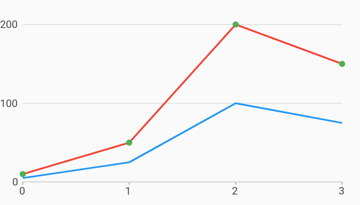

# Numeric Line Point Combo Chart Example



Example:

```
/// Example of a numeric combo chart with two series rendered as lines, and a
/// third rendered as points along the top line with a different color.
///
/// This example demonstrates a method for drawing points along a line using a
/// different color from the main series color. The line renderer supports
/// drawing points with the "includePoints" option, but those points will share
/// the same color as the line.
import 'package:charts_flutter/flutter.dart' as charts;
import 'package:flutter/material.dart';

class NumericComboLinePointChart extends StatelessWidget {
  final List<charts.Series> seriesList;
  final bool animate;

  NumericComboLinePointChart(this.seriesList, {this.animate});

  /// Creates a [LineChart] with sample data and no transition.
  factory NumericComboLinePointChart.withSampleData() {
    return new NumericComboLinePointChart(
      _createSampleData(),
      // Disable animations for image tests.
      animate: false,
    );
  }


  @override
  Widget build(BuildContext context) {
    return new charts.NumericComboChart(seriesList,
        animate: animate,
        // Configure the default renderer as a line renderer. This will be used
        // for any series that does not define a rendererIdKey.
        defaultRenderer: new charts.LineRendererConfig(),
        // Custom renderer configuration for the point series.
        customSeriesRenderers: [
          new charts.PointRendererConfig(
              // ID used to link series to this renderer.
              customRendererId: 'customPoint')
        ]);
  }

  /// Create one series with sample hard coded data.
  static List<charts.Series<LinearSales, int>> _createSampleData() {
    final desktopSalesData = [
      new LinearSales(0, 5),
      new LinearSales(1, 25),
      new LinearSales(2, 100),
      new LinearSales(3, 75),
    ];

    final tableSalesData = [
      new LinearSales(0, 10),
      new LinearSales(1, 50),
      new LinearSales(2, 200),
      new LinearSales(3, 150),
    ];

    final mobileSalesData = [
      new LinearSales(0, 10),
      new LinearSales(1, 50),
      new LinearSales(2, 200),
      new LinearSales(3, 150),
    ];

    return [
      new charts.Series<LinearSales, int>(
        id: 'Desktop',
        colorFn: (_, __) => charts.MaterialPalette.blue.shadeDefault,
        domainFn: (LinearSales sales, _) => sales.year,
        measureFn: (LinearSales sales, _) => sales.sales,
        data: desktopSalesData,
      ),
      new charts.Series<LinearSales, int>(
        id: 'Tablet',
        colorFn: (_, __) => charts.MaterialPalette.red.shadeDefault,
        domainFn: (LinearSales sales, _) => sales.year,
        measureFn: (LinearSales sales, _) => sales.sales,
        data: tableSalesData,
      ),
      new charts.Series<LinearSales, int>(
          id: 'Mobile',
          colorFn: (_, __) => charts.MaterialPalette.green.shadeDefault,
          domainFn: (LinearSales sales, _) => sales.year,
          measureFn: (LinearSales sales, _) => sales.sales,
          data: mobileSalesData)
        // Configure our custom point renderer for this series.
        ..setAttribute(charts.rendererIdKey, 'customPoint'),
    ];
  }
}

/// Sample linear data type.
class LinearSales {
  final int year;
  final int sales;

  LinearSales(this.year, this.sales);
}
```
