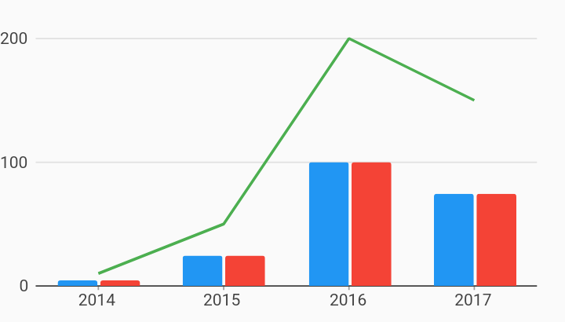

# Ordinal Bar Line Combo Chart Example



Example:

```
/// Example of an ordinal combo chart with two series rendered as bars, and a
/// third rendered as a line.
import 'package:flutter/material.dart';
import 'package:charts_flutter/flutter.dart' as charts;

class OrdinalComboBarLineChart extends StatelessWidget {
  final List<charts.Series> seriesList;
  final bool animate;

  OrdinalComboBarLineChart(this.seriesList, {this.animate});

  factory OrdinalComboBarLineChart.withSampleData() {
    return new OrdinalComboBarLineChart(
      _createSampleData(),
      // Disable animations for image tests.
      animate: false,
    );
  }


  @override
  Widget build(BuildContext context) {
    return new charts.OrdinalComboChart(seriesList,
        animate: animate,
        // Configure the default renderer as a bar renderer.
        defaultRenderer: new charts.BarRendererConfig(
            groupingType: charts.BarGroupingType.grouped),
        // Custom renderer configuration for the line series. This will be used for
        // any series that does not define a rendererIdKey.
        customSeriesRenderers: [
          new charts.LineRendererConfig(
              // ID used to link series to this renderer.
              customRendererId: 'customLine')
        ]);
  }

  /// Create series list with multiple series
  static List<charts.Series<OrdinalSales, String>> _createSampleData() {
    final desktopSalesData = [
      new OrdinalSales('2014', 5),
      new OrdinalSales('2015', 25),
      new OrdinalSales('2016', 100),
      new OrdinalSales('2017', 75),
    ];

    final tableSalesData = [
      new OrdinalSales('2014', 5),
      new OrdinalSales('2015', 25),
      new OrdinalSales('2016', 100),
      new OrdinalSales('2017', 75),
    ];

    final mobileSalesData = [
      new OrdinalSales('2014', 10),
      new OrdinalSales('2015', 50),
      new OrdinalSales('2016', 200),
      new OrdinalSales('2017', 150),
    ];

    return [
      new charts.Series<OrdinalSales, String>(
          id: 'Desktop',
          colorFn: (_, __) => charts.MaterialPalette.blue.shadeDefault,
          domainFn: (OrdinalSales sales, _) => sales.year,
          measureFn: (OrdinalSales sales, _) => sales.sales,
          data: desktopSalesData),
      new charts.Series<OrdinalSales, String>(
          id: 'Tablet',
          colorFn: (_, __) => charts.MaterialPalette.red.shadeDefault,
          domainFn: (OrdinalSales sales, _) => sales.year,
          measureFn: (OrdinalSales sales, _) => sales.sales,
          data: tableSalesData),
      new charts.Series<OrdinalSales, String>(
          id: 'Mobile ',
          colorFn: (_, __) => charts.MaterialPalette.green.shadeDefault,
          domainFn: (OrdinalSales sales, _) => sales.year,
          measureFn: (OrdinalSales sales, _) => sales.sales,
          data: mobileSalesData)
        // Configure our custom line renderer for this series.
        ..setAttribute(charts.rendererIdKey, 'customLine'),
    ];
  }
}

/// Sample ordinal data type.
class OrdinalSales {
  final String year;
  final int sales;

  OrdinalSales(this.year, this.sales);
}
```
