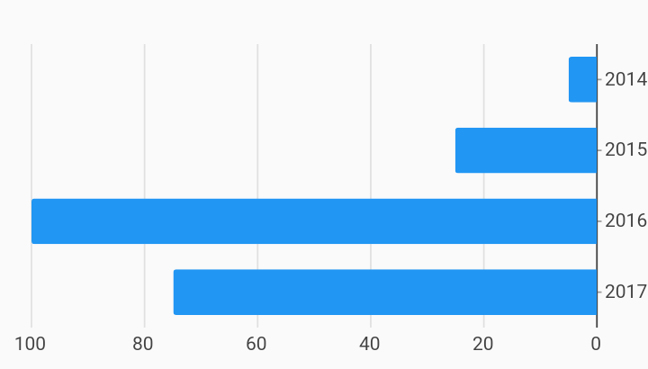

# Rtl Bar Chart i18n Example



Example:

```
/// RTL Bar chart example
import 'package:charts_flutter/flutter.dart' as charts;
import 'package:flutter/material.dart';

class RTLBarChart extends StatelessWidget {
  final List<charts.Series> seriesList;
  final bool animate;

  RTLBarChart(this.seriesList, {this.animate});

  /// Creates a [BarChart] with sample data and no transition.
  factory RTLBarChart.withSampleData() {
    return new RTLBarChart(
      _createSampleData(),
      // Disable animations for image tests.
      animate: false,
    );
  }


  @override
  Widget build(BuildContext context) {
    // Charts will determine if RTL is enabled by checking the directionality by
    // requesting Directionality.of(context). This returns the text direction
    // from the closest instance of that encloses the context passed to build
    // the chart. A [TextDirection.rtl] will be treated as a RTL chart. This
    // means that the directionality widget does not have to directly wrap each
    // chart. It is show here as an example only.
    //
    // By default, when a chart detects RTL:
    // Measure axis positions are flipped. Primary measure axis is on the right
    // and the secondary measure axis is on the left (when used).
    // Domain axis' first domain starts on the right and grows left.
    //
    // Optionally, [RTLSpec] can be passed in when creating the chart to specify
    // chart display settings in RTL mode.
    return new Directionality(
        textDirection: TextDirection.rtl,
        child: new charts.BarChart(
          seriesList,
          animate: animate,
          vertical: false,
        ));
  }

  /// Create one series with sample hard coded data.
  static List<charts.Series<OrdinalSales, String>> _createSampleData() {
    final data = [
      new OrdinalSales('2014', 5),
      new OrdinalSales('2015', 25),
      new OrdinalSales('2016', 100),
      new OrdinalSales('2017', 75),
    ];

    return [
      new charts.Series<OrdinalSales, String>(
        id: 'Sales',
        domainFn: (OrdinalSales sales, _) => sales.year,
        measureFn: (OrdinalSales sales, _) => sales.sales,
        data: data,
      )
    ];
  }
}

/// Sample ordinal data type.
class OrdinalSales {
  final String year;
  final int sales;

  OrdinalSales(this.year, this.sales);
}
```
