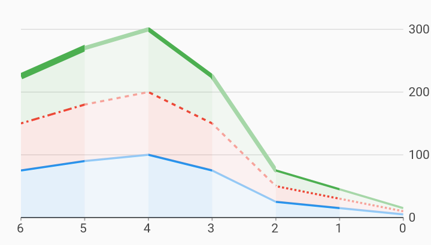

# Rtl Line Segments i18n Example



Example:

```
/// Example of a RTL stacked area chart with changing styles within each line.
///
/// Each series of data in this example contains different values for color,
/// dashPattern, or strokeWidthPx between each datum. The line and area skirt
/// will be rendered in segments, with the styling of the series changing when
/// these data attributes change.
///
/// Note that if a dashPattern or strokeWidth value is not found for a
/// particular datum, then the chart will fall back to use the value defined in
/// the [charts.LineRendererConfig]. This could be used, for example, to define
/// a default dash pattern for the series, with only a specific datum called out
/// with a different pattern.
import 'package:charts_flutter/flutter.dart' as charts;
import 'package:flutter/material.dart';

class RTLLineSegments extends StatelessWidget {
  final List<charts.Series> seriesList;
  final bool animate;

  RTLLineSegments(this.seriesList, {this.animate});

  /// Creates a [LineChart] with sample data and no transition.
  factory RTLLineSegments.withSampleData() {
    return new RTLLineSegments(
      _createSampleData(),
      // Disable animations for image tests.
      animate: false,
    );
  }


  @override
  Widget build(BuildContext context) {
    // Charts will determine if RTL is enabled by checking the directionality by
    // requesting Directionality.of(context). This returns the text direction
    // from the closest instance of that encloses the context passed to build
    // the chart. A [TextDirection.rtl] will be treated as a RTL chart. This
    // means that the directionality widget does not have to directly wrap each
    // chart. It is show here as an example only.
    //
    // By default, when a chart detects RTL:
    // Measure axis positions are flipped. Primary measure axis is on the right
    // and the secondary measure axis is on the left (when used).
    // Domain axis' first domain starts on the right and grows left.
    return new Directionality(
        textDirection: TextDirection.rtl,
        child: new charts.LineChart(
          seriesList,
          defaultRenderer:
              new charts.LineRendererConfig(includeArea: true, stacked: true),
          animate: animate,
        ));
  }

  /// Create one series with sample hard coded data.
  static List<charts.Series<LinearSales, int>> _createSampleData() {
    // Series of data with static dash pattern and stroke width. The colorFn
    // accessor will colorize each datum (for all three series).
    final colorChangeData = [
      new LinearSales(0, 5, null, 2.0),
      new LinearSales(1, 15, null, 2.0),
      new LinearSales(2, 25, null, 2.0),
      new LinearSales(3, 75, null, 2.0),
      new LinearSales(4, 100, null, 2.0),
      new LinearSales(5, 90, null, 2.0),
      new LinearSales(6, 75, null, 2.0),
    ];

    // Series of data with changing color and dash pattern.
    final dashPatternChangeData = [
      new LinearSales(0, 5, [2, 2], 2.0),
      new LinearSales(1, 15, [2, 2], 2.0),
      new LinearSales(2, 25, [4, 4], 2.0),
      new LinearSales(3, 75, [4, 4], 2.0),
      new LinearSales(4, 100, [4, 4], 2.0),
      new LinearSales(5, 90, [8, 3, 2, 3], 2.0),
      new LinearSales(6, 75, [8, 3, 2, 3], 2.0),
    ];

    // Series of data with changing color and stroke width.
    final strokeWidthChangeData = [
      new LinearSales(0, 5, null, 2.0),
      new LinearSales(1, 15, null, 2.0),
      new LinearSales(2, 25, null, 4.0),
      new LinearSales(3, 75, null, 4.0),
      new LinearSales(4, 100, null, 4.0),
      new LinearSales(5, 90, null, 6.0),
      new LinearSales(6, 75, null, 6.0),
    ];

    // Generate 2 shades of each color so that we can style the line segments.
    final blue = charts.MaterialPalette.blue.makeShades(2);
    final red = charts.MaterialPalette.red.makeShades(2);
    final green = charts.MaterialPalette.green.makeShades(2);

    return [
      new charts.Series<LinearSales, int>(
        id: 'Color Change',
        // Light shade for even years, dark shade for odd.
        colorFn: (LinearSales sales, _) =>
            sales.year % 2 == 0 ? blue[1] : blue[0],
        dashPatternFn: (LinearSales sales, _) => sales.dashPattern,
        strokeWidthPxFn: (LinearSales sales, _) => sales.strokeWidthPx,
        domainFn: (LinearSales sales, _) => sales.year,
        measureFn: (LinearSales sales, _) => sales.sales,
        data: colorChangeData,
      ),
      new charts.Series<LinearSales, int>(
        id: 'Dash Pattern Change',
        // Light shade for even years, dark shade for odd.
        colorFn: (LinearSales sales, _) =>
            sales.year % 2 == 0 ? red[1] : red[0],
        dashPatternFn: (LinearSales sales, _) => sales.dashPattern,
        strokeWidthPxFn: (LinearSales sales, _) => sales.strokeWidthPx,
        domainFn: (LinearSales sales, _) => sales.year,
        measureFn: (LinearSales sales, _) => sales.sales,
        data: dashPatternChangeData,
      ),
      new charts.Series<LinearSales, int>(
        id: 'Stroke Width Change',
        // Light shade for even years, dark shade for odd.
        colorFn: (LinearSales sales, _) =>
            sales.year % 2 == 0 ? green[1] : green[0],
        dashPatternFn: (LinearSales sales, _) => sales.dashPattern,
        strokeWidthPxFn: (LinearSales sales, _) => sales.strokeWidthPx,
        domainFn: (LinearSales sales, _) => sales.year,
        measureFn: (LinearSales sales, _) => sales.sales,
        data: strokeWidthChangeData,
      ),
    ];
  }
}

/// Sample linear data type.
class LinearSales {
  final int year;
  final int sales;
  final List<int> dashPattern;
  final double strokeWidthPx;

  LinearSales(this.year, this.sales, this.dashPattern, this.strokeWidthPx);
}
```
