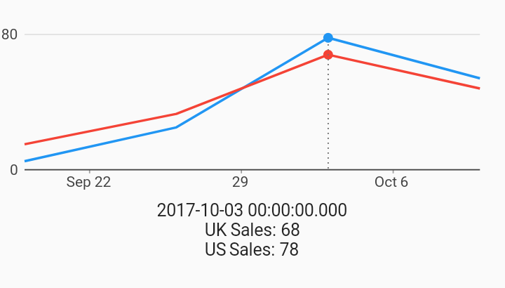

# Selection Callback Example Interactions Example



Example:

```
/// Timeseries chart with example of updating external state based on selection.
///
/// A SelectionModelConfig can be provided for each of the different
/// [SelectionModel] (currently info and action).
///
/// [SelectionModelType.info] is the default selection chart exploration type
/// initiated by some tap event. This is a different model from
/// [SelectionModelType.action] which is typically used to select some value as
/// an input to some other UI component. This allows dual state of exploring
/// and selecting data via different touch events.
///
/// See [SelectNearest] behavior on setting the different ways of triggering
/// [SelectionModel] updates from hover & click events.
import 'package:charts_flutter/flutter.dart' as charts;
import 'package:flutter/material.dart';

class SelectionCallbackExample extends StatefulWidget {
  final List<charts.Series> seriesList;
  final bool animate;

  SelectionCallbackExample(this.seriesList, {this.animate});

  /// Creates a [charts.TimeSeriesChart] with sample data and no transition.
  factory SelectionCallbackExample.withSampleData() {
    return new SelectionCallbackExample(
      _createSampleData(),
      // Disable animations for image tests.
      animate: false,
    );
  }


  // We need a Stateful widget to build the selection details with the current
  // selection as the state.
  @override
  State<StatefulWidget> createState() => new _SelectionCallbackState();

  /// Create one series with sample hard coded data.
  static List<charts.Series<TimeSeriesSales, DateTime>> _createSampleData() {
    final us_data = [
      new TimeSeriesSales(new DateTime(2017, 9, 19), 5),
      new TimeSeriesSales(new DateTime(2017, 9, 26), 25),
      new TimeSeriesSales(new DateTime(2017, 10, 3), 78),
      new TimeSeriesSales(new DateTime(2017, 10, 10), 54),
    ];

    final uk_data = [
      new TimeSeriesSales(new DateTime(2017, 9, 19), 15),
      new TimeSeriesSales(new DateTime(2017, 9, 26), 33),
      new TimeSeriesSales(new DateTime(2017, 10, 3), 68),
      new TimeSeriesSales(new DateTime(2017, 10, 10), 48),
    ];

    return [
      new charts.Series<TimeSeriesSales, DateTime>(
        id: 'US Sales',
        domainFn: (TimeSeriesSales sales, _) => sales.time,
        measureFn: (TimeSeriesSales sales, _) => sales.sales,
        data: us_data,
      ),
      new charts.Series<TimeSeriesSales, DateTime>(
        id: 'UK Sales',
        domainFn: (TimeSeriesSales sales, _) => sales.time,
        measureFn: (TimeSeriesSales sales, _) => sales.sales,
        data: uk_data,
      )
    ];
  }
}

class _SelectionCallbackState extends State<SelectionCallbackExample> {
  DateTime _time;
  Map<String, num> _measures;

  // Listens to the underlying selection changes, and updates the information
  // relevant to building the primitive legend like information under the
  // chart.
  _onSelectionChanged(charts.SelectionModel model) {
    final selectedDatum = model.selectedDatum;

    DateTime time;
    final measures = <String, num>{};

    // We get the model that updated with a list of [SeriesDatum] which is
    // simply a pair of series & datum.
    //
    // Walk the selection updating the measures map, storing off the sales and
    // series name for each selection point.
    if (selectedDatum.isNotEmpty) {
      time = selectedDatum.first.datum.time;
      selectedDatum.forEach((charts.SeriesDatum datumPair) {
        measures[datumPair.series.displayName] = datumPair.datum.sales;
      });
    }

    // Request a build.
    setState(() {
      _time = time;
      _measures = measures;
    });
  }

  @override
  Widget build(BuildContext context) {
    // The children consist of a Chart and Text widgets below to hold the info.
    final children = <Widget>[
      new SizedBox(
          height: 150.0,
          child: new charts.TimeSeriesChart(
            widget.seriesList,
            animate: widget.animate,
            selectionModels: [
              new charts.SelectionModelConfig(
                type: charts.SelectionModelType.info,
                listener: _onSelectionChanged,
              )
            ],
          )),
    ];

    // If there is a selection, then include the details.
    if (_time != null) {
      children.add(new Padding(
          padding: new EdgeInsets.only(top: 5.0),
          child: new Text(_time.toString())));
    }
    _measures?.forEach((String series, num value) {
      children.add(new Text('${series}: ${value}'));
    });

    return new Column(children: children);
  }
}

/// Sample time series data type.
class TimeSeriesSales {
  final DateTime time;
  final int sales;

  TimeSeriesSales(this.time, this.sales);
}
```
