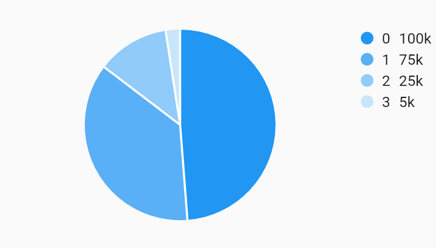

# Datum Legend With Measures Legends Example



Example:

```
/// Bar chart with example of a legend with customized position, justification,
/// desired max rows, and padding. These options are shown as an example of how
/// to use the customizations, they do not necessary have to be used together in
/// this way. Choosing [end] as the position does not require the justification
/// to also be [endDrawArea].
import 'package:flutter/material.dart';
import 'package:charts_flutter/flutter.dart' as charts;

/// Example that shows how to build a datum legend that shows measure values.
///
/// Also shows the option to provide a custom measure formatter.
class DatumLegendWithMeasures extends StatelessWidget {
  final List<charts.Series> seriesList;
  final bool animate;

  DatumLegendWithMeasures(this.seriesList, {this.animate});

  factory DatumLegendWithMeasures.withSampleData() {
    return new DatumLegendWithMeasures(
      _createSampleData(),
      // Disable animations for image tests.
      animate: false,
    );
  }


  @override
  Widget build(BuildContext context) {
    return new charts.PieChart(
      seriesList,
      animate: animate,
      // Add the legend behavior to the chart to turn on legends.
      // This example shows how to optionally show measure and provide a custom
      // formatter.
      behaviors: [
        new charts.DatumLegend(
          // Positions for "start" and "end" will be left and right respectively
          // for widgets with a build context that has directionality ltr.
          // For rtl, "start" and "end" will be right and left respectively.
          // Since this example has directionality of ltr, the legend is
          // positioned on the right side of the chart.
          position: charts.BehaviorPosition.end,
          // By default, if the position of the chart is on the left or right of
          // the chart, [horizontalFirst] is set to false. This means that the
          // legend entries will grow as new rows first instead of a new column.
          horizontalFirst: false,
          // This defines the padding around each legend entry.
          cellPadding: new EdgeInsets.only(right: 4.0, bottom: 4.0),
          // Set [showMeasures] to true to display measures in series legend.
          showMeasures: true,
          // Configure the measure value to be shown by default in the legend.
          legendDefaultMeasure: charts.LegendDefaultMeasure.firstValue,
          // Optionally provide a measure formatter to format the measure value.
          // If none is specified the value is formatted as a decimal.
          measureFormatter: (num value) {
            return value == null ? '-' : '${value}k';
          },
        ),
      ],
    );
  }

  /// Create series list with one series
  static List<charts.Series<LinearSales, int>> _createSampleData() {
    final data = [
      new LinearSales(0, 100),
      new LinearSales(1, 75),
      new LinearSales(2, 25),
      new LinearSales(3, 5),
    ];

    return [
      new charts.Series<LinearSales, int>(
        id: 'Sales',
        domainFn: (LinearSales sales, _) => sales.year,
        measureFn: (LinearSales sales, _) => sales.sales,
        data: data,
      )
    ];
  }
}

/// Sample linear data type.
class LinearSales {
  final int year;
  final int sales;

  LinearSales(this.year, this.sales);
}
```
