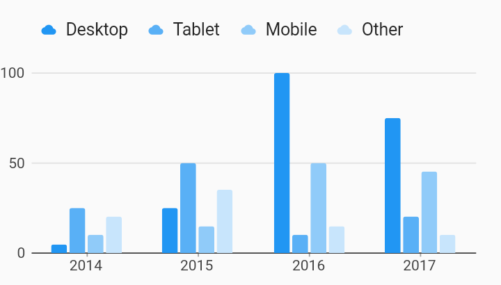

# Legend Custom Symbol Legends Example



Example:

```
/// Bar chart with custom symbol in legend example.
import 'package:flutter/material.dart';
import 'package:charts_flutter/flutter.dart' as charts;

/// Example custom renderer that renders [IconData].
///
/// This is used to show that legend symbols can be assigned a custom symbol.
class IconRenderer extends charts.SymbolRenderer {
  final IconData iconData;

  IconRenderer(this.iconData);

  @override
  Widget build(BuildContext context,
      {Size size, Color color, bool isSelected}) {
    return new SizedBox.fromSize(
        size: size, child: new Icon(iconData, color: color, size: 12.0));
  }
}

class LegendWithCustomSymbol extends StatelessWidget {
  final List<charts.Series> seriesList;
  final bool animate;

  LegendWithCustomSymbol(this.seriesList, {this.animate});

  factory LegendWithCustomSymbol.withSampleData() {
    return new LegendWithCustomSymbol(
      _createSampleData(),
      // Disable animations for image tests.
      animate: false,
    );
  }


  @override
  Widget build(BuildContext context) {
    return new charts.BarChart(
      seriesList,
      animate: animate,
      barGroupingType: charts.BarGroupingType.grouped,
      // Add the legend behavior to the chart to turn on legends.
      // By default the legend will display above the chart.
      //
      // To change the symbol used in the legend, set the renderer attribute of
      // symbolRendererKey to a SymbolRenderer.
      behaviors: [new charts.SeriesLegend()],
      defaultRenderer: new charts.BarRendererConfig(
          symbolRenderer: new IconRenderer(Icons.cloud)),
    );
  }

  /// Create series list with multiple series
  static List<charts.Series<OrdinalSales, String>> _createSampleData() {
    final desktopSalesData = [
      new OrdinalSales('2014', 5),
      new OrdinalSales('2015', 25),
      new OrdinalSales('2016', 100),
      new OrdinalSales('2017', 75),
    ];

    final tabletSalesData = [
      new OrdinalSales('2014', 25),
      new OrdinalSales('2015', 50),
      new OrdinalSales('2016', 10),
      new OrdinalSales('2017', 20),
    ];

    final mobileSalesData = [
      new OrdinalSales('2014', 10),
      new OrdinalSales('2015', 15),
      new OrdinalSales('2016', 50),
      new OrdinalSales('2017', 45),
    ];

    final otherSalesData = [
      new OrdinalSales('2014', 20),
      new OrdinalSales('2015', 35),
      new OrdinalSales('2016', 15),
      new OrdinalSales('2017', 10),
    ];

    return [
      new charts.Series<OrdinalSales, String>(
        id: 'Desktop',
        domainFn: (OrdinalSales sales, _) => sales.year,
        measureFn: (OrdinalSales sales, _) => sales.sales,
        data: desktopSalesData,
      ),
      new charts.Series<OrdinalSales, String>(
        id: 'Tablet',
        domainFn: (OrdinalSales sales, _) => sales.year,
        measureFn: (OrdinalSales sales, _) => sales.sales,
        data: tabletSalesData,
      ),
      new charts.Series<OrdinalSales, String>(
        id: 'Mobile',
        domainFn: (OrdinalSales sales, _) => sales.year,
        measureFn: (OrdinalSales sales, _) => sales.sales,
        data: mobileSalesData,
      ),
      new charts.Series<OrdinalSales, String>(
        id: 'Other',
        domainFn: (OrdinalSales sales, _) => sales.year,
        measureFn: (OrdinalSales sales, _) => sales.sales,
        data: otherSalesData,
      )
    ];
  }
}

/// Sample ordinal data type.
class OrdinalSales {
  final String year;
  final int sales;

  OrdinalSales(this.year, this.sales);
}
```
