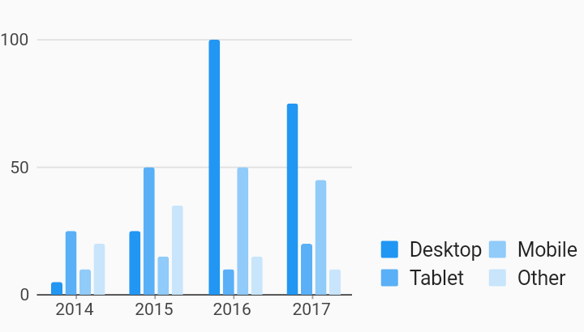

# Legend Options Legends Example



Example:

```
/// Bar chart with example of a legend with customized position, justification,
/// desired max rows, and padding. These options are shown as an example of how
/// to use the customizations, they do not necessary have to be used together in
/// this way. Choosing [end] as the position does not require the justification
/// to also be [endDrawArea].
import 'package:flutter/material.dart';
import 'package:charts_flutter/flutter.dart' as charts;

class LegendOptions extends StatelessWidget {
  final List<charts.Series> seriesList;
  final bool animate;

  LegendOptions(this.seriesList, {this.animate});

  factory LegendOptions.withSampleData() {
    return new LegendOptions(
      _createSampleData(),
      // Disable animations for image tests.
      animate: false,
    );
  }


  @override
  Widget build(BuildContext context) {
    return new charts.BarChart(
      seriesList,
      animate: animate,
      barGroupingType: charts.BarGroupingType.grouped,
      // Add the legend behavior to the chart to turn on legends.
      // This example shows how to change the position and justification of
      // the legend, in addition to altering the max rows and padding.
      behaviors: [
        new charts.SeriesLegend(
          // Positions for "start" and "end" will be left and right respectively
          // for widgets with a build context that has directionality ltr.
          // For rtl, "start" and "end" will be right and left respectively.
          // Since this example has directionality of ltr, the legend is
          // positioned on the right side of the chart.
          position: charts.BehaviorPosition.end,
          // For a legend that is positioned on the left or right of the chart,
          // setting the justification for [endDrawArea] is aligned to the
          // bottom of the chart draw area.
          outsideJustification: charts.OutsideJustification.endDrawArea,
          // By default, if the position of the chart is on the left or right of
          // the chart, [horizontalFirst] is set to false. This means that the
          // legend entries will grow as new rows first instead of a new column.
          horizontalFirst: false,
          // By setting this value to 2, the legend entries will grow up to two
          // rows before adding a new column.
          desiredMaxRows: 2,
          // This defines the padding around each legend entry.
          cellPadding: new EdgeInsets.only(right: 4.0, bottom: 4.0),
        )
      ],
    );
  }

  /// Create series list with multiple series
  static List<charts.Series<OrdinalSales, String>> _createSampleData() {
    final desktopSalesData = [
      new OrdinalSales('2014', 5),
      new OrdinalSales('2015', 25),
      new OrdinalSales('2016', 100),
      new OrdinalSales('2017', 75),
    ];

    final tabletSalesData = [
      new OrdinalSales('2014', 25),
      new OrdinalSales('2015', 50),
      new OrdinalSales('2016', 10),
      new OrdinalSales('2017', 20),
    ];

    final mobileSalesData = [
      new OrdinalSales('2014', 10),
      new OrdinalSales('2015', 15),
      new OrdinalSales('2016', 50),
      new OrdinalSales('2017', 45),
    ];

    final otherSalesData = [
      new OrdinalSales('2014', 20),
      new OrdinalSales('2015', 35),
      new OrdinalSales('2016', 15),
      new OrdinalSales('2017', 10),
    ];

    return [
      new charts.Series<OrdinalSales, String>(
        id: 'Desktop',
        domainFn: (OrdinalSales sales, _) => sales.year,
        measureFn: (OrdinalSales sales, _) => sales.sales,
        data: desktopSalesData,
      ),
      new charts.Series<OrdinalSales, String>(
        id: 'Tablet',
        domainFn: (OrdinalSales sales, _) => sales.year,
        measureFn: (OrdinalSales sales, _) => sales.sales,
        data: tabletSalesData,
      ),
      new charts.Series<OrdinalSales, String>(
        id: 'Mobile',
        domainFn: (OrdinalSales sales, _) => sales.year,
        measureFn: (OrdinalSales sales, _) => sales.sales,
        data: mobileSalesData,
      ),
      new charts.Series<OrdinalSales, String>(
        id: 'Other',
        domainFn: (OrdinalSales sales, _) => sales.year,
        measureFn: (OrdinalSales sales, _) => sales.sales,
        data: otherSalesData,
      ),
    ];
  }
}

/// Sample ordinal data type.
class OrdinalSales {
  final String year;
  final int sales;

  OrdinalSales(this.year, this.sales);
}
```
