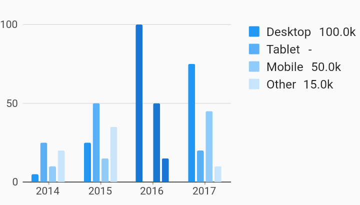

# Legend With Measures Legends Example



Example:

```
/// Bar chart with example of a legend with customized position, justification,
/// desired max rows, and padding. These options are shown as an example of how
/// to use the customizations, they do not necessary have to be used together in
/// this way. Choosing [end] as the position does not require the justification
/// to also be [endDrawArea].
import 'package:flutter/material.dart';
import 'package:charts_flutter/flutter.dart' as charts;

/// Example that shows how to build a series legend that shows measure values
/// when a datum is selected.
///
/// Also shows the option to provide a custom measure formatter.
class LegendWithMeasures extends StatelessWidget {
  final List<charts.Series> seriesList;
  final bool animate;

  LegendWithMeasures(this.seriesList, {this.animate});

  factory LegendWithMeasures.withSampleData() {
    return new LegendWithMeasures(
      _createSampleData(),
      // Disable animations for image tests.
      animate: false,
    );
  }


  @override
  Widget build(BuildContext context) {
    return new charts.BarChart(
      seriesList,
      animate: animate,
      barGroupingType: charts.BarGroupingType.grouped,
      // Add the legend behavior to the chart to turn on legends.
      // This example shows how to optionally show measure and provide a custom
      // formatter.
      behaviors: [
        new charts.SeriesLegend(
          // Positions for "start" and "end" will be left and right respectively
          // for widgets with a build context that has directionality ltr.
          // For rtl, "start" and "end" will be right and left respectively.
          // Since this example has directionality of ltr, the legend is
          // positioned on the right side of the chart.
          position: charts.BehaviorPosition.end,
          // By default, if the position of the chart is on the left or right of
          // the chart, [horizontalFirst] is set to false. This means that the
          // legend entries will grow as new rows first instead of a new column.
          horizontalFirst: false,
          // This defines the padding around each legend entry.
          cellPadding: new EdgeInsets.only(right: 4.0, bottom: 4.0),
          // Set show measures to true to display measures in series legend,
          // when the datum is selected.
          showMeasures: true,
          // Optionally provide a measure formatter to format the measure value.
          // If none is specified the value is formatted as a decimal.
          measureFormatter: (num value) {
            return value == null ? '-' : '${value}k';
          },
        ),
      ],
    );
  }

  /// Create series list with multiple series
  static List<charts.Series<OrdinalSales, String>> _createSampleData() {
    final desktopSalesData = [
      new OrdinalSales('2014', 5),
      new OrdinalSales('2015', 25),
      new OrdinalSales('2016', 100),
      new OrdinalSales('2017', 75),
    ];

    final tabletSalesData = [
      new OrdinalSales('2014', 25),
      new OrdinalSales('2015', 50),
      // Purposely have a null data for 2016 to show the null value format.
      new OrdinalSales('2017', 20),
    ];

    final mobileSalesData = [
      new OrdinalSales('2014', 10),
      new OrdinalSales('2015', 15),
      new OrdinalSales('2016', 50),
      new OrdinalSales('2017', 45),
    ];

    final otherSalesData = [
      new OrdinalSales('2014', 20),
      new OrdinalSales('2015', 35),
      new OrdinalSales('2016', 15),
      new OrdinalSales('2017', 10),
    ];

    return [
      new charts.Series<OrdinalSales, String>(
        id: 'Desktop',
        domainFn: (OrdinalSales sales, _) => sales.year,
        measureFn: (OrdinalSales sales, _) => sales.sales,
        data: desktopSalesData,
      ),
      new charts.Series<OrdinalSales, String>(
        id: 'Tablet',
        domainFn: (OrdinalSales sales, _) => sales.year,
        measureFn: (OrdinalSales sales, _) => sales.sales,
        data: tabletSalesData,
      ),
      new charts.Series<OrdinalSales, String>(
        id: 'Mobile',
        domainFn: (OrdinalSales sales, _) => sales.year,
        measureFn: (OrdinalSales sales, _) => sales.sales,
        data: mobileSalesData,
      ),
      new charts.Series<OrdinalSales, String>(
        id: 'Other',
        domainFn: (OrdinalSales sales, _) => sales.year,
        measureFn: (OrdinalSales sales, _) => sales.sales,
        data: otherSalesData,
      ),
    ];
  }
}

/// Sample ordinal data type.
class OrdinalSales {
  final String year;
  final int sales;

  OrdinalSales(this.year, this.sales);
}
```
