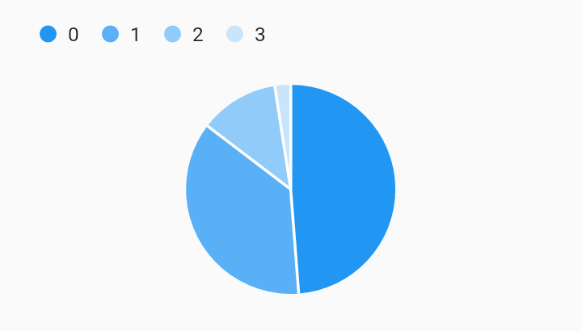

# Simple Datum Legend Legends Example



Example:

```
/// Bar chart with series legend example
import 'package:flutter/material.dart';
import 'package:charts_flutter/flutter.dart' as charts;

class SimpleDatumLegend extends StatelessWidget {
  final List<charts.Series> seriesList;
  final bool animate;

  SimpleDatumLegend(this.seriesList, {this.animate});

  factory SimpleDatumLegend.withSampleData() {
    return new SimpleDatumLegend(
      _createSampleData(),
      // Disable animations for image tests.
      animate: false,
    );
  }


  @override
  Widget build(BuildContext context) {
    return new charts.PieChart(
      seriesList,
      animate: animate,
      // Add the series legend behavior to the chart to turn on series legends.
      // By default the legend will display above the chart.
      behaviors: [new charts.DatumLegend()],
    );
  }

  /// Create series list with one series
  static List<charts.Series<LinearSales, int>> _createSampleData() {
    final data = [
      new LinearSales(0, 100),
      new LinearSales(1, 75),
      new LinearSales(2, 25),
      new LinearSales(3, 5),
    ];

    return [
      new charts.Series<LinearSales, int>(
        id: 'Sales',
        domainFn: (LinearSales sales, _) => sales.year,
        measureFn: (LinearSales sales, _) => sales.sales,
        data: data,
      )
    ];
  }
}

/// Sample linear data type.
class LinearSales {
  final int year;
  final int sales;

  LinearSales(this.year, this.sales);
}
```
