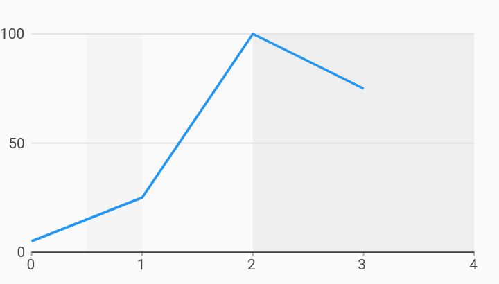

# Range Annotation Line Chart Example



Example:

```
/// Line chart with range annotation example
import 'package:charts_flutter/flutter.dart' as charts;
import 'package:flutter/material.dart';

class LineRangeAnnotationChart extends StatelessWidget {
  final List<charts.Series> seriesList;
  final bool animate;

  LineRangeAnnotationChart(this.seriesList, {this.animate});

  /// Creates a [LineChart] with sample data and range annotations.
  ///
  /// The second series extends beyond the range of the series data,
  /// demonstrating the effect of the [Charts.RangeAnnotation.extendAxis] flag.
  /// This can be set to false to disable range extension.
  factory LineRangeAnnotationChart.withSampleData() {
    return new LineRangeAnnotationChart(
      _createSampleData(),
      // Disable animations for image tests.
      animate: false,
    );
  }


  @override
  Widget build(BuildContext context) {
    return new charts.LineChart(seriesList, animate: animate, behaviors: [
      new charts.RangeAnnotation([
        new charts.RangeAnnotationSegment(
            0.5, 1.0, charts.RangeAnnotationAxisType.domain),
        new charts.RangeAnnotationSegment(
            2, 4, charts.RangeAnnotationAxisType.domain,
            color: charts.MaterialPalette.gray.shade200),
      ]),
    ]);
  }

  /// Create one series with sample hard coded data.
  static List<charts.Series<LinearSales, int>> _createSampleData() {
    final data = [
      new LinearSales(0, 5),
      new LinearSales(1, 25),
      new LinearSales(2, 100),
      new LinearSales(3, 75),
    ];

    return [
      new charts.Series<LinearSales, int>(
        id: 'Sales',
        domainFn: (LinearSales sales, _) => sales.year,
        measureFn: (LinearSales sales, _) => sales.sales,
        data: data,
      )
    ];
  }
}

/// Sample linear data type.
class LinearSales {
  final int year;
  final int sales;

  LinearSales(this.year, this.sales);
}
```
