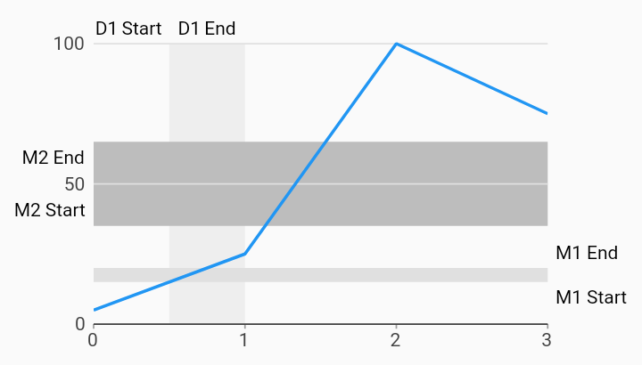

# Range Annotation Margin Line Chart Example



Example:

```
/// Example of a line chart with range annotations configured to render labels
/// in the chart margin area.
import 'package:charts_flutter/flutter.dart' as charts;
import 'package:flutter/material.dart';

class LineRangeAnnotationMarginChart extends StatelessWidget {
  final List<charts.Series> seriesList;
  final bool animate;

  LineRangeAnnotationMarginChart(this.seriesList, {this.animate});

  /// Creates a [LineChart] with sample data and range annotations.
  ///
  /// The second annotation extends beyond the range of the series data,
  /// demonstrating the effect of the [Charts.RangeAnnotation.extendAxis] flag.
  /// This can be set to false to disable range extension.
  factory LineRangeAnnotationMarginChart.withSampleData() {
    return new LineRangeAnnotationMarginChart(
      _createSampleData(),
      // Disable animations for image tests.
      animate: false,
    );
  }


  @override
  Widget build(BuildContext context) {
    return new charts.LineChart(seriesList,
        animate: animate,

        // Allow enough space in the left and right chart margins for the
        // annotations.
        layoutConfig: new charts.LayoutConfig(
            leftMarginSpec: new charts.MarginSpec.fixedPixel(60),
            topMarginSpec: new charts.MarginSpec.fixedPixel(20),
            rightMarginSpec: new charts.MarginSpec.fixedPixel(60),
            bottomMarginSpec: new charts.MarginSpec.fixedPixel(20)),
        behaviors: [
          // Define one domain and two measure annotations configured to render
          // labels in the chart margins.
          new charts.RangeAnnotation([
            new charts.RangeAnnotationSegment(
                0.5, 1.0, charts.RangeAnnotationAxisType.domain,
                startLabel: 'D1 Start',
                endLabel: 'D1 End',
                labelAnchor: charts.AnnotationLabelAnchor.end,
                color: charts.MaterialPalette.gray.shade200,
                // Override the default vertical direction for domain labels.
                labelDirection: charts.AnnotationLabelDirection.horizontal),
            new charts.RangeAnnotationSegment(
                15, 20, charts.RangeAnnotationAxisType.measure,
                startLabel: 'M1 Start',
                endLabel: 'M1 End',
                labelAnchor: charts.AnnotationLabelAnchor.end,
                color: charts.MaterialPalette.gray.shade300),
            new charts.RangeAnnotationSegment(
                35, 65, charts.RangeAnnotationAxisType.measure,
                startLabel: 'M2 Start',
                endLabel: 'M2 End',
                labelAnchor: charts.AnnotationLabelAnchor.start,
                color: charts.MaterialPalette.gray.shade400),
          ], defaultLabelPosition: charts.AnnotationLabelPosition.margin),
        ]);
  }

  /// Create one series with sample hard coded data.
  static List<charts.Series<LinearSales, int>> _createSampleData() {
    final data = [
      new LinearSales(0, 5),
      new LinearSales(1, 25),
      new LinearSales(2, 100),
      new LinearSales(3, 75),
    ];

    return [
      new charts.Series<LinearSales, int>(
        id: 'Sales',
        domainFn: (LinearSales sales, _) => sales.year,
        measureFn: (LinearSales sales, _) => sales.sales,
        data: data,
      )
    ];
  }
}

/// Sample linear data type.
class LinearSales {
  final int year;
  final int sales;

  LinearSales(this.year, this.sales);
}
```
