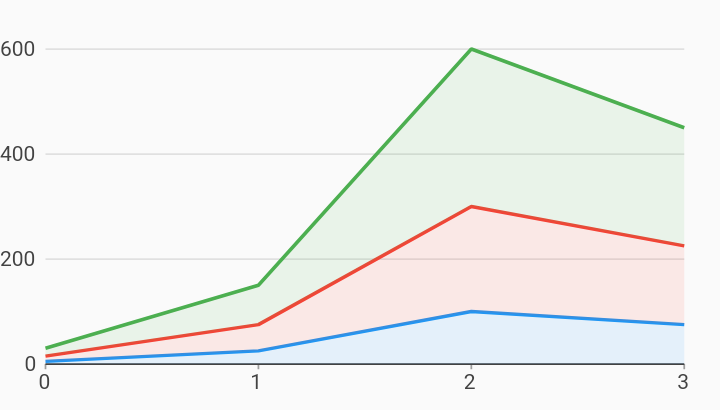

# Stacked Area Line Chart Example



Example:

```
/// Example of a stacked area chart.
import 'package:charts_flutter/flutter.dart' as charts;
import 'package:flutter/material.dart';

class StackedAreaLineChart extends StatelessWidget {
  final List<charts.Series> seriesList;
  final bool animate;

  StackedAreaLineChart(this.seriesList, {this.animate});

  /// Creates a [LineChart] with sample data and no transition.
  factory StackedAreaLineChart.withSampleData() {
    return new StackedAreaLineChart(
      _createSampleData(),
      // Disable animations for image tests.
      animate: false,
    );
  }


  @override
  Widget build(BuildContext context) {
    return new charts.LineChart(seriesList,
        defaultRenderer:
            new charts.LineRendererConfig(includeArea: true, stacked: true),
        animate: animate);
  }

  /// Create one series with sample hard coded data.
  static List<charts.Series<LinearSales, int>> _createSampleData() {
    final myFakeDesktopData = [
      new LinearSales(0, 5),
      new LinearSales(1, 25),
      new LinearSales(2, 100),
      new LinearSales(3, 75),
    ];

    var myFakeTabletData = [
      new LinearSales(0, 10),
      new LinearSales(1, 50),
      new LinearSales(2, 200),
      new LinearSales(3, 150),
    ];

    var myFakeMobileData = [
      new LinearSales(0, 15),
      new LinearSales(1, 75),
      new LinearSales(2, 300),
      new LinearSales(3, 225),
    ];

    return [
      new charts.Series<LinearSales, int>(
        id: 'Desktop',
        colorFn: (_, __) => charts.MaterialPalette.blue.shadeDefault,
        domainFn: (LinearSales sales, _) => sales.year,
        measureFn: (LinearSales sales, _) => sales.sales,
        data: myFakeDesktopData,
      ),
      new charts.Series<LinearSales, int>(
        id: 'Tablet',
        colorFn: (_, __) => charts.MaterialPalette.red.shadeDefault,
        domainFn: (LinearSales sales, _) => sales.year,
        measureFn: (LinearSales sales, _) => sales.sales,
        data: myFakeTabletData,
      ),
      new charts.Series<LinearSales, int>(
        id: 'Mobile',
        colorFn: (_, __) => charts.MaterialPalette.green.shadeDefault,
        domainFn: (LinearSales sales, _) => sales.year,
        measureFn: (LinearSales sales, _) => sales.sales,
        data: myFakeMobileData,
      ),
    ];
  }
}

/// Sample linear data type.
class LinearSales {
  final int year;
  final int sales;

  LinearSales(this.year, this.sales);
}
```
