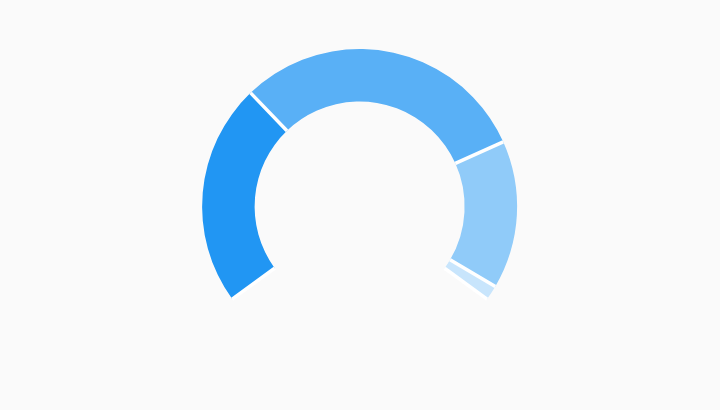

# Gauge Pie Chart Example



Example:

```
/// Gauge chart example, where the data does not cover a full revolution in the
/// chart.
import 'package:charts_flutter/flutter.dart' as charts;
import 'package:flutter/material.dart';

class GaugeChart extends StatelessWidget {
  final List<charts.Series> seriesList;
  final bool animate;

  GaugeChart(this.seriesList, {this.animate});

  /// Creates a [PieChart] with sample data and no transition.
  factory GaugeChart.withSampleData() {
    return new GaugeChart(
      _createSampleData(),
      // Disable animations for image tests.
      animate: false,
    );
  }


  @override
  Widget build(BuildContext context) {
    return new charts.PieChart(seriesList,
        animate: animate,
        // Configure the width of the pie slices to 30px. The remaining space in
        // the chart will be left as a hole in the center. Adjust the start
        // angle and the arc length of the pie so it resembles a gauge.
        defaultRenderer: new charts.ArcRendererConfig(
            arcWidth: 30, startAngle: 4 / 5 * pi, arcLength: 7 / 5 * pi));
  }

  /// Create one series with sample hard coded data.
  static List<charts.Series<GaugeSegment, String>> _createSampleData() {
    final data = [
      new GaugeSegment('Low', 75),
      new GaugeSegment('Acceptable', 100),
      new GaugeSegment('High', 50),
      new GaugeSegment('Highly Unusual', 5),
    ];

    return [
      new charts.Series<GaugeSegment, String>(
        id: 'Segments',
        domainFn: (GaugeSegment segment, _) => segment.segment,
        measureFn: (GaugeSegment segment, _) => segment.size,
        data: data,
      )
    ];
  }
}

/// Sample data type.
class GaugeSegment {
  final String segment;
  final int size;

  GaugeSegment(this.segment, this.size);
}
```
