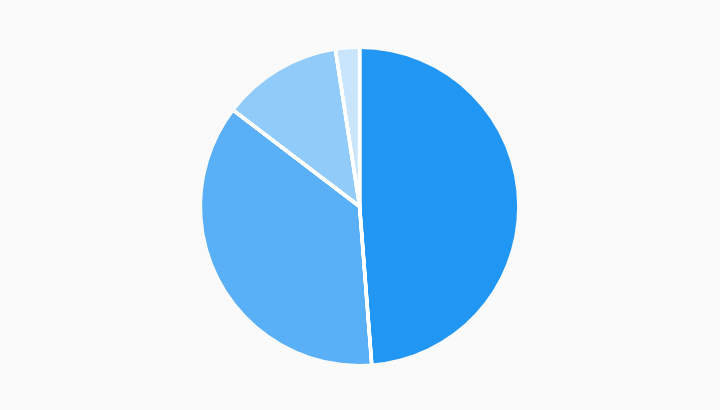

# Simple Pie Chart Example



Example:

```
/// Simple pie chart example.
import 'package:charts_flutter/flutter.dart' as charts;
import 'package:flutter/material.dart';

class SimplePieChart extends StatelessWidget {
  final List<charts.Series> seriesList;
  final bool animate;

  SimplePieChart(this.seriesList, {this.animate});

  /// Creates a [PieChart] with sample data and no transition.
  factory SimplePieChart.withSampleData() {
    return new SimplePieChart(
      _createSampleData(),
      // Disable animations for image tests.
      animate: false,
    );
  }


  @override
  Widget build(BuildContext context) {
    return new charts.PieChart(seriesList, animate: animate);
  }

  /// Create one series with sample hard coded data.
  static List<charts.Series<LinearSales, int>> _createSampleData() {
    final data = [
      new LinearSales(0, 100),
      new LinearSales(1, 75),
      new LinearSales(2, 25),
      new LinearSales(3, 5),
    ];

    return [
      new charts.Series<LinearSales, int>(
        id: 'Sales',
        domainFn: (LinearSales sales, _) => sales.year,
        measureFn: (LinearSales sales, _) => sales.sales,
        data: data,
      )
    ];
  }
}

/// Sample linear data type.
class LinearSales {
  final int year;
  final int sales;

  LinearSales(this.year, this.sales);
}
```
