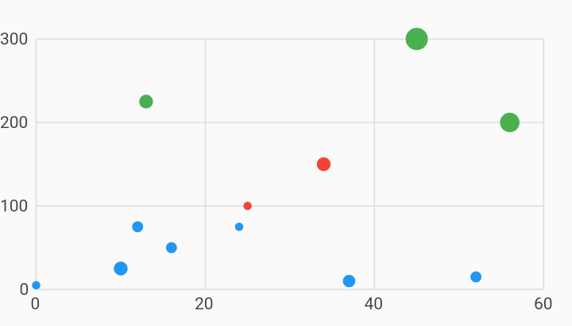

# Simple Scatter Plot Chart Example



Example:

```
/// Line chart example
import 'package:charts_flutter/flutter.dart' as charts;
import 'package:flutter/material.dart';

class SimpleScatterPlotChart extends StatelessWidget {
  final List<charts.Series> seriesList;
  final bool animate;

  SimpleScatterPlotChart(this.seriesList, {this.animate});

  /// Creates a [ScatterPlotChart] with sample data and no transition.
  factory SimpleScatterPlotChart.withSampleData() {
    return new SimpleScatterPlotChart(
      _createSampleData(),
      // Disable animations for image tests.
      animate: false,
    );
  }


  @override
  Widget build(BuildContext context) {
    return new charts.ScatterPlotChart(seriesList, animate: animate);
  }

  /// Create one series with sample hard coded data.
  static List<charts.Series<LinearSales, int>> _createSampleData() {
    final data = [
      new LinearSales(0, 5, 3.0),
      new LinearSales(10, 25, 5.0),
      new LinearSales(12, 75, 4.0),
      new LinearSales(13, 225, 5.0),
      new LinearSales(16, 50, 4.0),
      new LinearSales(24, 75, 3.0),
      new LinearSales(25, 100, 3.0),
      new LinearSales(34, 150, 5.0),
      new LinearSales(37, 10, 4.5),
      new LinearSales(45, 300, 8.0),
      new LinearSales(52, 15, 4.0),
      new LinearSales(56, 200, 7.0),
    ];

    final maxMeasure = 300;

    return [
      new charts.Series<LinearSales, int>(
        id: 'Sales',
        // Providing a color function is optional.
        colorFn: (LinearSales sales, _) {
          // Bucket the measure column value into 3 distinct colors.
          final bucket = sales.sales / maxMeasure;

          if (bucket < 1 / 3) {
            return charts.MaterialPalette.blue.shadeDefault;
          } else if (bucket < 2 / 3) {
            return charts.MaterialPalette.red.shadeDefault;
          } else {
            return charts.MaterialPalette.green.shadeDefault;
          }
        },
        domainFn: (LinearSales sales, _) => sales.year,
        measureFn: (LinearSales sales, _) => sales.sales,
        // Providing a radius function is optional.
        radiusPxFn: (LinearSales sales, _) => sales.radius,
        data: data,
      )
    ];
  }
}

/// Sample linear data type.
class LinearSales {
  final int year;
  final int sales;
  final double radius;

  LinearSales(this.year, this.sales, this.radius);
}
```
