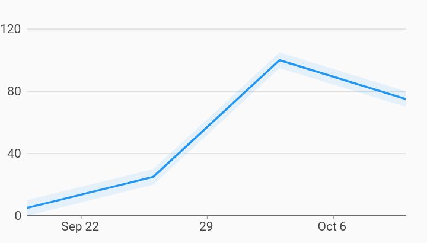

# Confidence Interval Time Series Charts Example



Example:

```
/// Example of a time series chart with a confidence interval.
///
/// Confidence interval is defined by specifying the upper and lower measure
/// bounds in the series.
import 'package:charts_flutter/flutter.dart' as charts;
import 'package:flutter/material.dart';

class TimeSeriesConfidenceInterval extends StatelessWidget {
  final List<charts.Series> seriesList;
  final bool animate;

  TimeSeriesConfidenceInterval(this.seriesList, {this.animate});

  /// Creates a [TimeSeriesChart] with sample data and no transition.
  factory TimeSeriesConfidenceInterval.withSampleData() {
    return new TimeSeriesConfidenceInterval(
      _createSampleData(),
      // Disable animations for image tests.
      animate: false,
    );
  }


  @override
  Widget build(BuildContext context) {
    return new charts.TimeSeriesChart(
      seriesList,
      animate: animate,
      // Optionally pass in a [DateTimeFactory] used by the chart. The factory
      // should create the same type of [DateTime] as the data provided. If none
      // specified, the default creates local date time.
      dateTimeFactory: const charts.LocalDateTimeFactory(),
    );
  }

  /// Create one series with sample hard coded data.
  static List<charts.Series<TimeSeriesSales, DateTime>> _createSampleData() {
    final data = [
      new TimeSeriesSales(new DateTime(2017, 9, 19), 5),
      new TimeSeriesSales(new DateTime(2017, 9, 26), 25),
      new TimeSeriesSales(new DateTime(2017, 10, 3), 100),
      new TimeSeriesSales(new DateTime(2017, 10, 10), 75),
    ];

    return [
      new charts.Series<TimeSeriesSales, DateTime>(
        id: 'Sales',
        colorFn: (_, __) => charts.MaterialPalette.blue.shadeDefault,
        domainFn: (TimeSeriesSales sales, _) => sales.time,
        measureFn: (TimeSeriesSales sales, _) => sales.sales,
        // When the measureLowerBoundFn and measureUpperBoundFn is defined,
        // the line renderer will render the area around the bounds.
        measureLowerBoundFn: (TimeSeriesSales sales, _) => sales.sales - 5,
        measureUpperBoundFn: (TimeSeriesSales sales, _) => sales.sales + 5,
        data: data,
      )
    ];
  }
}

/// Sample time series data type.
class TimeSeriesSales {
  final DateTime time;
  final int sales;

  TimeSeriesSales(this.time, this.sales);
}
```
