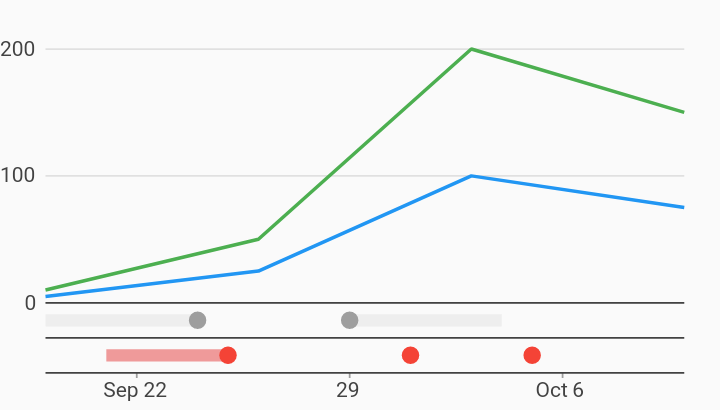

# Symbol Annotation Time Series Charts Example



Example:

```
/// Example of timeseries chart with annotation rows between the chart draw area
/// and the domain axis.
import 'package:charts_flutter/flutter.dart' as charts;
import 'package:flutter/material.dart';

class TimeSeriesSymbolAnnotationChart extends StatelessWidget {
  final List<charts.Series> seriesList;
  final bool animate;

  TimeSeriesSymbolAnnotationChart(this.seriesList, {this.animate});

  /// Creates a [TimeSeriesChart] with sample data and no transition.
  factory TimeSeriesSymbolAnnotationChart.withSampleData() {
    return new TimeSeriesSymbolAnnotationChart(
      _createSampleData(),
      // Disable animations for image tests.
      animate: false,
    );
  }


  @override
  Widget build(BuildContext context) {
    return new charts.TimeSeriesChart(
      seriesList,
      animate: animate,
      // Custom renderer configuration for the point series.
      customSeriesRenderers: [
        new charts.SymbolAnnotationRendererConfig(
            // ID used to link series to this renderer.
            customRendererId: 'customSymbolAnnotation')
      ],
      // Optionally pass in a [DateTimeFactory] used by the chart. The factory
      // should create the same type of [DateTime] as the data provided. If none
      // specified, the default creates local date time.
      dateTimeFactory: const charts.LocalDateTimeFactory(),
    );
  }

  /// Create one series with sample hard coded data.
  static List<charts.Series<TimeSeriesSales, DateTime>> _createSampleData() {
    final myDesktopData = [
      new TimeSeriesSales(timeCurrent: new DateTime(2017, 9, 19), sales: 5),
      new TimeSeriesSales(timeCurrent: new DateTime(2017, 9, 26), sales: 25),
      new TimeSeriesSales(timeCurrent: new DateTime(2017, 10, 3), sales: 100),
      new TimeSeriesSales(timeCurrent: new DateTime(2017, 10, 10), sales: 75),
    ];

    final myTabletData = [
      new TimeSeriesSales(timeCurrent: new DateTime(2017, 9, 19), sales: 10),
      new TimeSeriesSales(timeCurrent: new DateTime(2017, 9, 26), sales: 50),
      new TimeSeriesSales(timeCurrent: new DateTime(2017, 10, 3), sales: 200),
      new TimeSeriesSales(timeCurrent: new DateTime(2017, 10, 10), sales: 150),
    ];

    // Example of a series with two range annotations. A regular point shape
    // will be drawn at the current domain value, and a range shape will be
    // drawn between the previous and target domain values.
    //
    // Note that these series do not contain any measure values. They are
    // positioned automatically in rows.
    final myAnnotationData1 = [
      new TimeSeriesSales(
        timeCurrent: new DateTime(2017, 9, 24),
        timePrevious: new DateTime(2017, 9, 19),
        timeTarget: new DateTime(2017, 9, 24),
      ),
      new TimeSeriesSales(
        timeCurrent: new DateTime(2017, 9, 29),
        timePrevious: new DateTime(2017, 9, 29),
        timeTarget: new DateTime(2017, 10, 4),
      ),
    ];

    // Example of a series with one range annotation and two single point
    // annotations. Omitting the previous and target domain values causes that
    // datum to be drawn as a single point.
    final myAnnotationData2 = [
      new TimeSeriesSales(
        timeCurrent: new DateTime(2017, 9, 25),
        timePrevious: new DateTime(2017, 9, 21),
        timeTarget: new DateTime(2017, 9, 25),
      ),
      new TimeSeriesSales(timeCurrent: new DateTime(2017, 9, 31)),
      new TimeSeriesSales(timeCurrent: new DateTime(2017, 10, 5)),
    ];

    return [
      new charts.Series<TimeSeriesSales, DateTime>(
        id: 'Desktop',
        colorFn: (_, __) => charts.MaterialPalette.blue.shadeDefault,
        domainFn: (TimeSeriesSales sales, _) => sales.timeCurrent,
        measureFn: (TimeSeriesSales sales, _) => sales.sales,
        data: myDesktopData,
      ),
      new charts.Series<TimeSeriesSales, DateTime>(
        id: 'Tablet',
        colorFn: (_, __) => charts.MaterialPalette.green.shadeDefault,
        domainFn: (TimeSeriesSales sales, _) => sales.timeCurrent,
        measureFn: (TimeSeriesSales sales, _) => sales.sales,
        data: myTabletData,
      ),
      new charts.Series<TimeSeriesSales, DateTime>(
        id: 'Annotation Series 1',
        colorFn: (_, __) => charts.MaterialPalette.gray.shadeDefault,
        domainFn: (TimeSeriesSales sales, _) => sales.timeCurrent,
        domainLowerBoundFn: (TimeSeriesSales row, _) => row.timePrevious,
        domainUpperBoundFn: (TimeSeriesSales row, _) => row.timeTarget,
        // No measure values are needed for symbol annotations.
        measureFn: (_, __) => null,
        data: myAnnotationData1,
      )
        // Configure our custom symbol annotation renderer for this series.
        ..setAttribute(charts.rendererIdKey, 'customSymbolAnnotation')
        // Optional radius for the annotation shape. If not specified, this will
        // default to the same radius as the points.
        ..setAttribute(charts.boundsLineRadiusPxKey, 3.5),
      new charts.Series<TimeSeriesSales, DateTime>(
        id: 'Annotation Series 2',
        colorFn: (_, __) => charts.MaterialPalette.red.shadeDefault,
        domainFn: (TimeSeriesSales sales, _) => sales.timeCurrent,
        domainLowerBoundFn: (TimeSeriesSales row, _) => row.timePrevious,
        domainUpperBoundFn: (TimeSeriesSales row, _) => row.timeTarget,
        // No measure values are needed for symbol annotations.
        measureFn: (_, __) => null,
        data: myAnnotationData2,
      )
        // Configure our custom symbol annotation renderer for this series.
        ..setAttribute(charts.rendererIdKey, 'customSymbolAnnotation')
        // Optional radius for the annotation shape. If not specified, this will
        // default to the same radius as the points.
        ..setAttribute(charts.boundsLineRadiusPxKey, 3.5),
    ];
  }
}

/// Sample time series data type.
class TimeSeriesSales {
  final DateTime timeCurrent;
  final DateTime timePrevious;
  final DateTime timeTarget;
  final int sales;

  TimeSeriesSales(
      {this.timeCurrent, this.timePrevious, this.timeTarget, this.sales});
}
```
