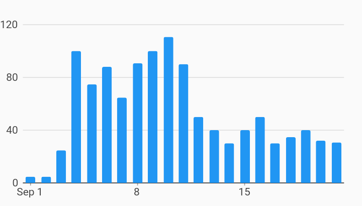

# With Bar Renderer Time Series Charts Example



Example:

```
/// Example of a time series chart using a bar renderer.
import 'package:charts_flutter/flutter.dart' as charts;
import 'package:flutter/material.dart';

class TimeSeriesBar extends StatelessWidget {
  final List<charts.Series<TimeSeriesSales, DateTime>> seriesList;
  final bool animate;

  TimeSeriesBar(this.seriesList, {this.animate});

  /// Creates a [TimeSeriesChart] with sample data and no transition.
  factory TimeSeriesBar.withSampleData() {
    return new TimeSeriesBar(
      _createSampleData(),
      // Disable animations for image tests.
      animate: false,
    );
  }


  @override
  Widget build(BuildContext context) {
    return new charts.TimeSeriesChart(
      seriesList,
      animate: animate,
      // Set the default renderer to a bar renderer.
      // This can also be one of the custom renderers of the time series chart.
      defaultRenderer: new charts.BarRendererConfig<DateTime>(),
      // It is recommended that default interactions be turned off if using bar
      // renderer, because the line point highlighter is the default for time
      // series chart.
      defaultInteractions: false,
      // If default interactions were removed, optionally add select nearest
      // and the domain highlighter that are typical for bar charts.
      behaviors: [new charts.SelectNearest(), new charts.DomainHighlighter()],
    );
  }

  /// Create one series with sample hard coded data.
  static List<charts.Series<TimeSeriesSales, DateTime>> _createSampleData() {
    final data = [
      new TimeSeriesSales(new DateTime(2017, 9, 1), 5),
      new TimeSeriesSales(new DateTime(2017, 9, 2), 5),
      new TimeSeriesSales(new DateTime(2017, 9, 3), 25),
      new TimeSeriesSales(new DateTime(2017, 9, 4), 100),
      new TimeSeriesSales(new DateTime(2017, 9, 5), 75),
      new TimeSeriesSales(new DateTime(2017, 9, 6), 88),
      new TimeSeriesSales(new DateTime(2017, 9, 7), 65),
      new TimeSeriesSales(new DateTime(2017, 9, 8), 91),
      new TimeSeriesSales(new DateTime(2017, 9, 9), 100),
      new TimeSeriesSales(new DateTime(2017, 9, 10), 111),
      new TimeSeriesSales(new DateTime(2017, 9, 11), 90),
      new TimeSeriesSales(new DateTime(2017, 9, 12), 50),
      new TimeSeriesSales(new DateTime(2017, 9, 13), 40),
      new TimeSeriesSales(new DateTime(2017, 9, 14), 30),
      new TimeSeriesSales(new DateTime(2017, 9, 15), 40),
      new TimeSeriesSales(new DateTime(2017, 9, 16), 50),
      new TimeSeriesSales(new DateTime(2017, 9, 17), 30),
      new TimeSeriesSales(new DateTime(2017, 9, 18), 35),
      new TimeSeriesSales(new DateTime(2017, 9, 19), 40),
      new TimeSeriesSales(new DateTime(2017, 9, 20), 32),
      new TimeSeriesSales(new DateTime(2017, 9, 21), 31),
    ];

    return [
      new charts.Series<TimeSeriesSales, DateTime>(
        id: 'Sales',
        colorFn: (_, __) => charts.MaterialPalette.blue.shadeDefault,
        domainFn: (TimeSeriesSales sales, _) => sales.time,
        measureFn: (TimeSeriesSales sales, _) => sales.sales,
        data: data,
      )
    ];
  }
}

/// Sample time series data type.
class TimeSeriesSales {
  final DateTime time;
  final int sales;

  TimeSeriesSales(this.time, this.sales);
}
```
