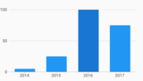
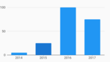
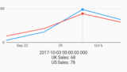
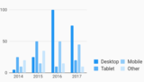

## Gallery

[//]: (Do_NOT_modify_gallery__generate_from_code)
[//]: (START_EXAMPLES)

### Bar Charts

| | | | |
| --- | --- | --- | --- |
| Simple  | Stacked  | Grouped  | Grouped Stacked  |
| Grouped Target Line  | Stacked Horizontal  | Stacked Target Line  | Horizontal  |
| Horizontal Bar Label  | Horizontal Bar Label Custom  | Spark Bar  | Grouped Fill Color  |
| Stacked Fill Color  | Pattern Forward Hatch  | Horizontal Pattern Forward Hatch  | Custom Rounded Bars  |

### Time Series Charts

| | | | |
| --- | --- | --- | --- |
| Simple  | Range Annotation  | | |

### Line Charts

| | | | |
| --- | --- | --- | --- |
| Simple  | Points  | Stacked Area  | Area And Line  |
| Dash Pattern  | Range Annotation  | | |

### Scatter Plot Charts

| | | | |
| --- | --- | --- | --- |
| Simple  | Comparison Points  | | |

### Pie Charts

| | | | |
| --- | --- | --- | --- |
| Simple  | Donut  | | |

### Axes

| | | | |
| --- | --- | --- | --- |
| Bar Secondary Axis  | Bar Secondary Axis Only  | Horizontal Bar Secondary Axis  | Short Tick Length Axis  |
| Custom Font Size And Color  | Measure Axis Label Alignment  | Hidden Ticks And Labels Axis  | Custom Axis Tick Formatters  |
| Custom Measure Tick Count  | Integer Only Measure Axis  | Nonzero Bound Measure Axis  | Nonzero Bound Measure Axis  |
| Statically Provided Ticks  | Ordinal Initial Viewport  | Numeric Initial Viewport  | |

### Interactions

| | | | |
| --- | --- | --- | --- |
| Initial Selection  | Selection Bar Highlight  | Selection Line Highlight  | Selection Callback Example  |

### a11y

| | | | |
| --- | --- | --- | --- |
| Domain A11y Explore Bar Chart  | | | |

### i18n

| | | | |
| --- | --- | --- | --- |
| Rtl Bar Chart  | Rtl Line Chart  | Rtl Series Legend  | |

### Legends

| | | | |
| --- | --- | --- | --- |
| Simple Series Legend  | Legend Options  | Legend Custom Symbol  | Default Hidden Series Legend  |

### Hovercards

| | | | |
| --- | --- | --- | --- |

[//]: (END_EXAMPLES)

### Combo Charts

### Sizing & Margins
