## Gallery

[//]: (Do_NOT_modify_gallery__generate_from_code)
[//]: (START_EXAMPLES)

### Bar Charts

| | | | |
| --- | --- | --- | --- |
| Simple [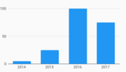](example/bar_charts/simple) | Stacked [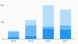](example/bar_charts/stacked) | Grouped [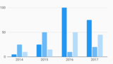](example/bar_charts/grouped) | Grouped Stacked [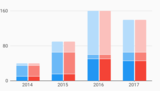](example/bar_charts/grouped_stacked) |
| Grouped Target Line [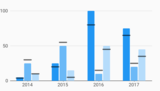](example/bar_charts/grouped_target_line) | Stacked Horizontal [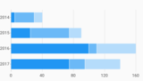](example/bar_charts/stacked_horizontal) | Stacked Target Line [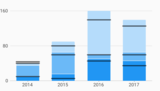](example/bar_charts/stacked_target_line) | Horizontal [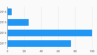](example/bar_charts/horizontal) |
| Horizontal Bar Label  | Horizontal Bar Label Custom [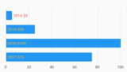](example/bar_charts/horizontal_bar_label_custom) | Spark Bar  | Grouped Fill Color [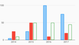](example/bar_charts/grouped_fill_color) |
| Stacked Fill Color [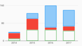](example/bar_charts/stacked_fill_color) | Pattern Forward Hatch [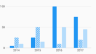](example/bar_charts/pattern_forward_hatch) | Horizontal Pattern Forward Hatch [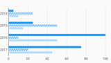](example/bar_charts/horizontal_pattern_forward_hatch) | Grouped Stacked Weight Pattern  |
| Custom Rounded Bars [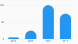](example/bar_charts/custom_rounded_bars) | | | |

### Time Series Charts

| | | | |
| --- | --- | --- | --- |
| Simple [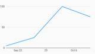](example/time_series_charts/simple) | End Points Axis [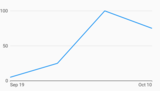](example/time_series_charts/end_points_axis) | Confidence Interval [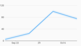](example/time_series_charts/confidence_interval) | Line Annotation [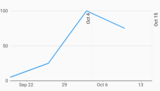](example/time_series_charts/line_annotation) |
| Range Annotation  | Range Annotation Margin [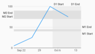](example/time_series_charts/range_annotation_margin) | Symbol Annotation [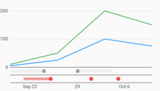](example/time_series_charts/symbol_annotation) | With Bar Renderer [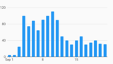](example/time_series_charts/with_bar_renderer) |

### Line Charts

| | | | |
| --- | --- | --- | --- |
| Simple [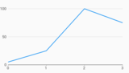](example/line_charts/simple) | Points [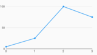](example/line_charts/points) | Stacked Area [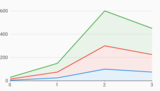](example/line_charts/stacked_area) | Stacked Area Custom Color [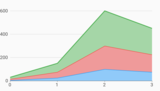](example/line_charts/stacked_area_custom_color) |
| Area And Line [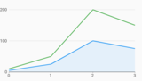](example/line_charts/area_and_line) | Simple Nulls [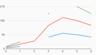](example/line_charts/simple_nulls) | Stacked Area Nulls [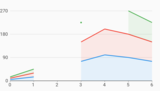](example/line_charts/stacked_area_nulls) | Dash Pattern [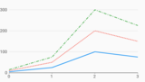](example/line_charts/dash_pattern) |
| Segments [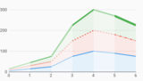](example/line_charts/segments) | Line Annotation [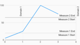](example/line_charts/line_annotation) | Range Annotation [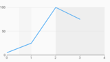](example/line_charts/range_annotation) | Range Annotation Margin [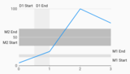](example/line_charts/range_annotation_margin) |

### Scatter Plot Charts

| | | | |
| --- | --- | --- | --- |
| Simple [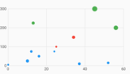](example/scatter_plot_charts/simple) | Shapes [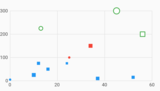](example/scatter_plot_charts/shapes) | Comparison Points [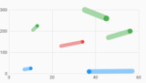](example/scatter_plot_charts/comparison_points) | Bucketing Axis [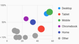](example/scatter_plot_charts/bucketing_axis) |

### Combo Charts

| | | | |
| --- | --- | --- | --- |
| Ordinal Bar Line [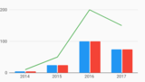](example/combo_charts/ordinal_bar_line) | Numeric Line Bar [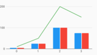](example/combo_charts/numeric_line_bar) | Numeric Line Point [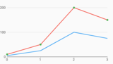](example/combo_charts/numeric_line_point) | Date Time Line Point [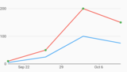](example/combo_charts/date_time_line_point) |
| Scatter Plot Line [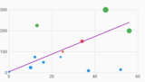](example/combo_charts/scatter_plot_line) | | | |

### Pie Charts

| | | | |
| --- | --- | --- | --- |
| Simple [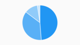](example/pie_charts/simple) | Outside Label [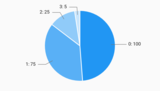](example/pie_charts/outside_label) | Partial Pie  | Donut  |
| Auto Label [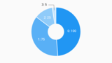](example/pie_charts/auto_label) | Gauge  | | |

### Axes

| | | | |
| --- | --- | --- | --- |
| Bar Secondary Axis [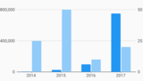](example/axes/bar_secondary_axis) | Bar Secondary Axis Only [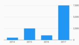](example/axes/bar_secondary_axis_only) | Horizontal Bar Secondary Axis [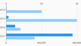](example/axes/horizontal_bar_secondary_axis) | Flipped Vertical Axis [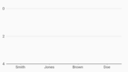](example/axes/flipped_vertical_axis) |
| Short Tick Length Axis  | Custom Font Size And Color  | Measure Axis Label Alignment [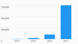](example/axes/measure_axis_label_alignment) | Hidden Ticks And Labels Axis  |
| Custom Axis Tick Formatters  | Custom Measure Tick Count  | Integer Only Measure Axis  | Nonzero Bound Measure Axis  |
| Nonzero Bound Measure Axis  | Statically Provided Ticks  | Ordinal Initial Viewport  | Numeric Initial Viewport  |
| Gridline Dash Pattern  | Line Disjoint Axis  | | |

### Legends

| | | | |
| --- | --- | --- | --- |
| Simple Series Legend  | Series Legend Options  | Series Legend With Measures  | Legend Custom Symbol  |
| Default Hidden Series Legend  | Simple Datum Legend  | Datum Legend Options  | Datum Legend With Measures  |

### Hovercards

| | | | |
| --- | --- | --- | --- |

### Behaviors

| | | | |
| --- | --- | --- | --- |
| Initial Selection  | Selection Bar Highlight  | Selection Line Highlight  | Selection User Managed  |
| Selection Callback Example  | Chart Title  | Slider  | Sliding Viewport On Selection  |
| Percent Of Domain  | Percent Of Domain By Category  | Percent Of Series  | Initial Hint Animation  |

### a11y

| | | | |
| --- | --- | --- | --- |
| Domain A11y Explore Bar Chart  | | | |

### i18n

| | | | |
| --- | --- | --- | --- |
| Rtl Bar Chart  | Rtl Line Chart  | Rtl Line Segments  | Rtl Series Legend  |

[//]: (END_EXAMPLES)

### Combo Charts

### Sizing & Margins
